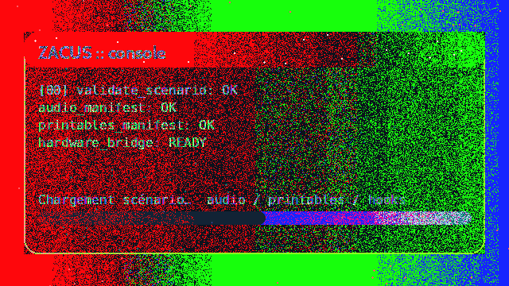
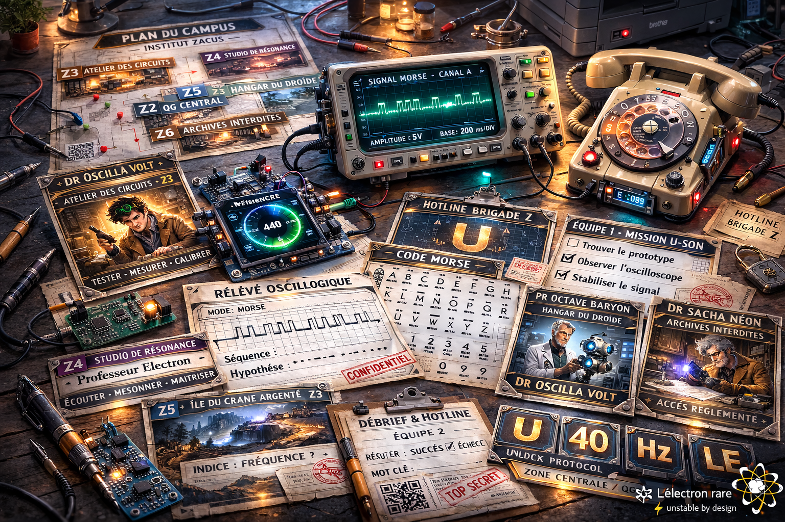

# 🤖🎩 Le Mystère du Professeur Zacus 🎩🤖


> **Bienvenue dans l’enquête la plus instable du multivers** : indices imprimables, audio, modules électroniques (option), et un guide MJ qui ne bug jamais (sauf si tu l’imprimes en 3D).
> **⚛ L’électron rare — ⚡ unstable by design**
> **Auteur : Clément SAILLANT**

[](./.github/workflows/validate.yml)
[](https://platformio.org/)
[](./LICENSE)
[](./LICENSE-CONTENT.md)


## ⚡ Pitch (30 secondes chrono)

Le Professeur Zacus a disparu. Son labo est sous tension : **signaux audio**, **capsules d’indices**, **preuves imprimées**… et un dispositif électronique optionnel qui réagit (parfois) à tes découvertes.

Les joueurs fouillent, recoupent, déduisent — comme une vraie équipe d’enquête, mais avec plus de blagues et moins de panique.
Le MJ déroule une session fluide, avec des checkpoints et une fin satisfaisante (sauf si tu oublies le gâteau).

> *"Si tu trouves une LED qui clignote, c’est normal. Si elle te parle, c’est probablement un bug... ou le MJ qui s’ennuie."*
---

## ✅ Ce que tu obtiens (concret, pas du vent)

- **Printables** prêts à imprimer (indices, cartes, accessoires)
- **Guide Maître du Jeu** (mise en place, script, solutions)
- **Audio** (timers / ambiance / déclenchements)
- **Scénario YAML** = source de vérité (durée/difficulté modulables)
- **Option électronique** : ESP32/Arduino (UI, effets, interactions)

> Tout est pensé pour être **rejouable** et **facile à préparer**. Même pour les MJ qui n’ont jamais touché un oscilloscope.
> *"MJ : Maître du Jeu, mais aussi Maître du Jazz, Maître du Jenga, Maître du Juste Prix... à toi de choisir."*

---

## 🕹️ Pour qui / durée / niveau de fun

- **Joueurs** : 6–14 (recommandé), ou équipes de 2–4
- **Durée** : 60–90 min (modulable, sauf si tu actives le mode “slow motion”)
- **Âge** : famille / anniversaire (adaptable, sauf pour les robots)
- **Matériel** : imprimante + (option) modules électroniques (simple si tu achète un kit tout prête genre freenove ou autres esp32 avec un écran)

> *"Le mode ‘slow motion’ est réservé aux anniversaires avec trop de bonbons."*

---

## 🎬 Démo



> *"Si tu croises un QR code dans les archives, scanne-le. Si tu croises un QR code sur ton gâteau, scanne-le aussi (on ne sait jamais)."*
---

## 🧠 Comment ça marche (en 1 minute, ou 42 secondes si tu es pressé)

### Source de vérité : le scénario YAML
Le scénario principal est dans `game/scenarios/`. Il pilote :
- les étapes / stations,
- les validations / codes,
- les exports (briefs MJ, docs, manifestes).

### Pipeline du repo
`game/scenarios/*.yaml → tools/ (validate + export) → kit MJ / printables / audio → (option) hardware/firmware/esp32`


---

## 🧩 Démarrage rapide (MJ, version turbo)

> *"Si tu veux une expérience vraiment futuriste, branche un ESP32 sur ton chat. (Non, ne fais pas ça, mais l’idée est marrante.)"*

1. Lis le **guide MJ** : `kit-maitre-du-jeu/`
2. Imprime les **printables** : `printables/`
3. Prépare l’audio : `audio/`
4. (Option) Achete, cable et Flash l’électronique : `hardware/` (un kit esp32-S3 avec écran est parfait... ou un vieux grille-pain, mais c’est moins efficace)
5. Lance la partie 🎩

👉 FAQ / dépannage : `docs/faq.md` (aucune question idiote, sauf “où est le MJ ?”)

---

## 🛠️ Démarrage rapide (dev, version quantum)

> *"Astuce dev : Si tu valides le YAML sans erreur du premier coup, tu gagnes un badge ‘Zacus Quantum’ (à imprimer toi-même)."*

Installer les validateurs :
```bash
bash tools/setup/install_validators.sh
```

Valider le scénario officiel :
```bash
python3 tools/scenario/validate_scenario.py game/scenarios/zacus_v1.yaml
```

Exporter un brief Markdown :
```bash
python3 tools/scenario/export_md.py game/scenarios/zacus_v1.yaml -o docs/exports/zacus_v1.md
```

---

## 🧾 Contenu du dépôt (repères galactiques)

> *"Ce dépôt est plus organisé que le bureau du Professeur Zacus (et ça, c’est pas peu dire)."*

```text
game/scenarios/              Scénarios YAML (source de vérité)
kit-maitre-du-jeu/           Guide MJ + solutions + script
printables/                  Cartes/indices + manifestes
audio/                       Manifestes audio + ressources
tools/                       Validation + export + génération
hardware/                    Firmware & accessoires électroniques (option)
docs/                        Mini-site / FAQ / ressources
```

---

## 🧷 Visuels

> *"Si tu reconnais le prototype sur la photo, tu es officiellement un expert en électronique de fête."*




---

## 🧑‍🎓 Licence

- **Code** : MIT (`LICENSE`)
- **Contenu créatif** (scénarios, docs, printables, assets) : CC BY‑NC 4.0 (`LICENSE-CONTENT.md`)


> *"Ce jeu est garanti sans IA malveillante, mais avec des enfants qui peuvent hacker le scénario à tout moment."*
---

## 🤝 Crédits

> *"Merci à tous les MJ, enfants, parents, et robots qui ont testé ce scénario. Mention spéciale à ceux qui ont trouvé le twist avant la LED rouge."*

**Auteur : Clément SAILLANT**  
Signature : **⚛ L’électron rare** — **⚡ unstable by design**

> *"Ce projet a été validé par un oscilloscope, un grille-pain, et une IA qui adore les énigmes."*

---

OpenGraph : `assets/og.png` (1200×630)
- generation/story-ia : scénarios IA
