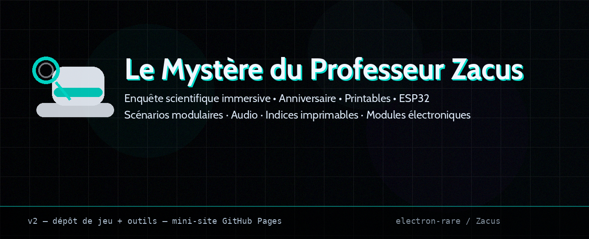
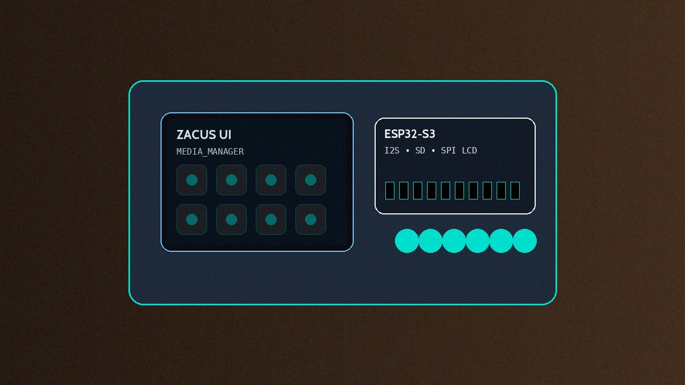
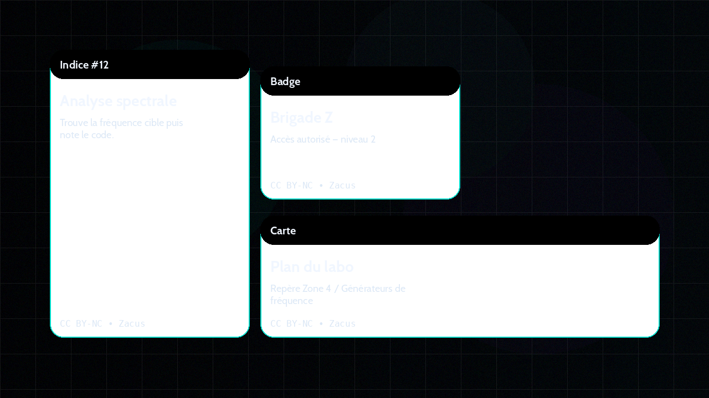

# 🎩 Le Mystère du Professeur Zacus



> **Une enquête scientifique cyber‑labo** pour anniversaire : indices imprimables, audio, modules électroniques intégrés, et un guide MJ ultra clair.  
> **⚛ L’électron rare — ⚡ unstable by design**  
> **Auteur : Clément SAILLANT**

[](./.github/workflows/validate.yml)
[](./LICENSES/MIT.txt)
[](./LICENSES/CC-BY-NC-4.0.txt)

---

## ⚡ Pitch (30 secondes)

Le Professeur Zacus a disparu. Dans son labo, tout est encore “sous tension” : **signaux audio**, **capsules d’indices**, **preuves imprimées**… et un dispositif électronique indispensable qui réagit aux découvertes.

Les joueurs fouillent, recoupent, déduisent — comme une vraie équipe d’enquête.  
Le MJ déroule une session fluide, avec des checkpoints et une fin satisfaisante.

---

## ✅ Ce que tu obtiens (concret)

- **Printables** prêts à imprimer (indices, cartes, accessoires)
- **Guide Maître du Jeu** (mise en place, script, solutions)
- **Audio** (timers / ambiance / déclenchements)
- **Scénario YAML** = source de vérité (durée/difficulté modulables)
- **Matériel électronique** : ESP32/Arduino (UI, effets, interactions) pour orchestrer les phases de jeu.

> Tout est pensé pour être **rejouable** et **facile à préparer**.

---

## 🕹️ Pour qui / durée

- **Joueurs** : 6–14 (recommandé), ou équipes de 2–4
- **Durée** : 105 min (45 + 60, modulable)
- **Âge** : famille / anniversaire (adaptable)
- **Matériel** : imprimante + modules électroniques (ESP32 + écran tactique) requis pour chaque partie

---

## 🎬 Démo


---

## 🧠 Comment ça marche (en 1 minute)

### Source de vérité : le scénario YAML
Le scénario principal est dans `game/scenarios/`. Il pilote :
- les étapes / stations,
- les validations / codes,
- les exports (briefs MJ, docs, manifestes).

### Pipeline du repo
`game/scenarios/*.yaml -> tools/ (validate + export) -> kit MJ / printables / audio -> hardware/firmware/`


---

## 🧩 Démarrage rapide (MJ)

1. Lis le **guide MJ** : `kit-maitre-du-jeu/`
2. Imprime les **printables** : `printables/`
3. Prépare l’audio : `audio/`
4. Prépare, câble et flashe l’électronique : `hardware/` (un kit esp32-S3 avec écran est requis pour la partie)
5. Lance la partie 🎩

👉 FAQ / dépannage : `docs/faq.md`

---

## 🛠️ Démarrage rapide (dev)

Installer les validateurs :
```bash
bash tools/setup/install_validators.sh
```

Valider le scénario officiel :
```bash
python3 tools/scenario/validate_scenario.py game/scenarios/zacus_v2.yaml
```

Exporter un brief Markdown :
```bash
python3 tools/scenario/export_md.py game/scenarios/zacus_v2.yaml -o docs/exports/zacus_v2.md
```

Frontend canon (V2) :
```bash
cd frontend-scratch-v2
npm install
VITE_STORY_API_BASE=http://<esp_ip>:8080 npm run dev
```

---

## 🧾 Contenu du dépôt (repères)

```text
game/scenarios/              Scénarios YAML (source de vérité)
kit-maitre-du-jeu/           Guide MJ + solutions + script
printables/                  Cartes/indices + manifestes
audio/                       Manifestes audio + ressources
tools/                       Validation + export + génération
hardware/                    Firmware & accessoires électroniques (prérequis)
docs/                        Mini-site / FAQ / ressources
```

---

## 🧷 Visuels





---

## 🧑‍🎓 Licence

- **Code** : MIT (`LICENSES/MIT.txt`)
- **Contenu créatif** (scénarios, docs, printables, assets) : CC BY‑NC 4.0 (`LICENSES/CC-BY-NC-4.0.txt`)

---

## 🤝 Crédits

**Auteur : Clément SAILLANT**  
Signature : **⚛ L’électron rare** — **⚡ unstable by design**

---

OpenGraph : `docs/assets/og.png` (1200×630)
