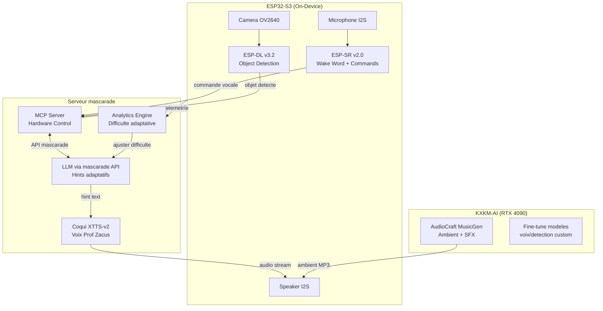

# Analyse IA & Intégration — Le Mystere du Professeur Zacus

> Generee le 2026-03-21 par analyse exhaustive (firmware, frontend, tooling, docs, web research)

---

## 1. SWOT — Firmware ESP32-S3

### Forces
- Architecture modulaire (audio/UI/network/scenario managers)
- Gestion memoire PSRAM mature (caps_allocator, fallback chains)
- Audio I2S avec protection underrun, DMA async
- LVGL avec DMA flush async, SIMD optionnel
- Runtime 3 step-based avec transitions event-driven

### Faiblesses (CRITIQUES)
| ID | Severite | Issue | Fichier |
|----|----------|-------|---------|
| FW-01 | CRITICAL | Credentials WiFi en dur | storage_manager.cpp:73 |
| FW-02 | CRITICAL | API web sans authentification | main.cpp:5932-5960 |
| FW-03 | HIGH | Watchdog timeout (calculator eval) | main.cpp + platformio.ini |
| FW-04 | HIGH | Pas de validation input API | main.cpp:5945-5950 |
| FW-05 | HIGH | Pas de rate limiting | main.cpp:5200-5960 |
| FW-06 | HIGH | Pas de timeout JSON parsing | main.cpp |
| FW-07 | MEDIUM | LVGL fragmentation (54KB pool) | platformio.ini:80 |
| FW-08 | MEDIUM | Audio underrun sans recovery | audio_manager.cpp:407-418 |
| FW-09 | MEDIUM | Buffer overflow string ops | ui_manager.cpp:145 |
| FW-10 | MEDIUM | Pas de HTTPS/TLS | main.cpp:5966 |

### Opportunites
- OTA firmware updates (partition scheme compatible)
- Secure Boot + Flash encryption (ESP32-S3 natif)
- Auth middleware centralise pour webOnApi()
- Watchdog supervisor software

---

## 2. SWOT — Frontend React+Blockly

### Forces
- Architecture composants clean (4 onglets)
- API client complet (30+ endpoints, dual protocol)
- Blockly bidirectionnel (workspace <-> YAML)
- TypeScript strict + Zod validation
- Accessibilite (aria-label, aria-live)

### Faiblesses
| ID | Severite | Issue | Fichier |
|----|----------|-------|---------|
| FE-01 | HIGH | Zero tests (0% coverage) | — |
| FE-02 | HIGH | Pas de React ErrorBoundary | App.tsx |
| FE-03 | HIGH | Pas de timeout API requests | api.ts:21-34 |
| FE-04 | MEDIUM | Blockly registration globale mutable | BlocklyDesigner.tsx:35-86 |
| FE-05 | MEDIUM | Pas de reconnexion WebSocket | api.ts:274-289 |
| FE-06 | MEDIUM | Bundle bloat (Blockly+Monaco ~2.5MB) | package.json |
| FE-07 | LOW | Tab state non persiste | App.tsx:22 |
| FE-08 | LOW | Pas de dark mode | App.css |

---

## 3. SWOT — Python Tooling

### Forces
- Pipeline clair (compile -> simulate -> validate -> export)
- Validation semantique comprehensive
- Simulation deterministe avec detection cycles (max_steps)
- Shell scripts robustes (set -euo pipefail)

### Faiblesses
| ID | Severite | Issue | Fichier |
|----|----------|-------|---------|
| PY-01 | HIGH | Seulement 5 tests (pas de negatifs) | test_runtime3_routes.py |
| PY-02 | HIGH | Pas de detection cycles transitions | runtime3_common.py:227-233 |
| PY-03 | MEDIUM | Schema version hard-codee (v1 only) | runtime3_common.py:196 |
| PY-04 | MEDIUM | normalize_token() fallback silencieux | runtime3_common.py:31-33 |
| PY-05 | LOW | Pas de TypedDict/dataclass partout | runtime3_common.py |

---

## 4. Documentation — Etat

| Zone | Completude | Action |
|------|-----------|--------|
| Architecture (8 maps) | 100% | A jour |
| Specifications (13 specs) | 90% | 3 specs critiques manquantes |
| Getting Started | 95% | OK |
| Operations | 30% | Runbook manquant |
| Securite | 10% | Stub seulement |
| Tests/QA | 40% | Pas de matrice unifiee |

### Specs MANQUANTES
1. `DEPLOYMENT_RUNBOOK.md` — procedures terrain
2. `SECURITY.md` — modele auth, menaces, remediations
3. `MCP_HARDWARE_SERVER_SPEC.md` — integration mascarade MCP
4. `ANALYTICS_OBSERVABILITY_SPEC.md` — telemetrie temps reel
5. `QA_TEST_MATRIX_SPEC.md` — matrice de tests formelle
6. `NETWORK_TOPOLOGY_SPEC.md` — ESP-NOW format messages

### Fichiers OBSOLETES a supprimer
- `docs/AGENTS 2.md`, `docs/AGENT_TODO 2.md` (duplicates)
- `docs/AGENTS_DOCS.md`, `docs/AGENTS_FIRMWARE.md` (remplace par .github/agents/)
- `docs/GENERER_UN_SCENARIO_STORY_V2.md` (references obsoletes)

---

## 5. Etat de l'Art IA 2026 — Opportunites d'Integration

### TOP 5 Technologies Prioritaires

| # | Technologie | Usage Zacus | Maturite | Licence |
|---|------------|-------------|----------|---------|
| 1 | **ESP-SR v2.0** (Espressif) | Wake word "Hey Zacus" + commandes vocales offline (300 mots) | Production | Espressif |
| 2 | **Coqui XTTS-v2** | Cloner la voix du Prof Zacus (6s sample) pour narration dynamique | Production | MPL-2.0 |
| 3 | **ESP-DL v3.2** | Detection objets on-device (YOLOv11n, 7 FPS) pour puzzles physiques | Production | MIT |
| 4 | **ESP RainMaker MCP** | Controle materiel via LLM ("allume la lampe UV salle 3") | Production | Apache 2.0 |
| 5 | **AudioCraft MusicGen** | Musique ambiante generative par salle/puzzle sur KXKM-AI | Production | MIT/CC-BY-NC |

### Projets de Reference

| Projet | Stars | Pertinence | URL |
|--------|-------|-----------|-----|
| **XiaoZhi ESP32** | 25k+ | Architecture quasi-identique (ESP32-S3 + wake + LLM + TTS via MCP) | github.com/78/xiaozhi-esp32 |
| **Willow** | — | Pipeline voix ESP32-S3 <500ms latence | github.com/HeyWillow/willow |
| **ClueControl** | — | Puzzles Arduino escape room (RFID, maglocks) | github.com/ClueControl |
| **EscapeRoom (devlinb)** | — | Backend Node.js anti-prompt-injection pour hints IA | github.com/devlinb/escaperoom |
| **IoT-MCP (Duke)** | — | Framework MCP pour IoT, 205ms latence, 74KB RAM | github.com/Duke-CEI-Center/IoT-MCP-Servers |

### Architecture IA Cible



---

## 6. Plan d'Integration IA — Phases

### Phase A: Fondations Securite (P0 — 1-2 semaines)
1. Supprimer credentials WiFi en dur → NVS + provisioning QR
2. Ajouter auth Bearer token sur tous les endpoints API
3. Input validation + rate limiting
4. Augmenter LVGL pool 54→96KB
5. Augmenter stack Arduino 16→24KB

### Phase B: Voice Pipeline (P1 — 2-4 semaines)
1. Integrer ESP-SR v2.0 pour wake word "Hey Zacus"
2. Deployer Coqui XTTS-v2 en Docker sur VM mascarade
3. Pipeline: ESP32 mic → WiFi stream → mascarade → LLM → TTS → ESP32 speaker
4. Commandes vocales offline (MultiNet, 50 mots FR)
5. Ref: XiaoZhi ESP32 architecture

### Phase C: Vision & Detection (P1 — 2-4 semaines)
1. Integrer ESP-DL v3.2 pour detection objets puzzle
2. Entrainer modele custom (props specifiques Zacus)
3. Face detection pour comptage joueurs (ESP-WHO)
4. Au-dela du QR basique: detection indices physiques

### Phase D: LLM Hints Adaptatifs (P2 — 4-6 semaines)
1. API mascarade comme backend LLM pour hints contextuels
2. Prompt engineering anti-triche (ref: devlinb/escaperoom)
3. Analytics temps reel → ajustement difficulte
4. Prof Zacus comme NPC LLM avec memoire conversation

### Phase E: Audio Generatif (P2 — 2-3 semaines)
1. AudioCraft MusicGen sur KXKM-AI (RTX 4090)
2. Generation ambiante par salle/puzzle
3. SFX dynamiques via Stable Audio Open
4. Streaming vers ESP32 speakers

### Phase F: MCP & Orchestration (P3 — 4-6 semaines)
1. MCP server hardware (ESP RainMaker MCP pattern)
2. Integration mascarade MCP existant
3. Controle naturel-language de tous les peripheriques
4. Dashboard game master temps reel

---

## 7. Corrections Prioritaires Code

### Immediate (cette semaine)
```
FW-01: storage_manager.cpp — NVS credentials
FW-02: main.cpp — Bearer auth middleware
FW-03: platformio.ini — stack 16→24KB
FE-02: App.tsx — ErrorBoundary wrapper
FE-03: api.ts — timeout 5s defaut
```

### Court terme (2 semaines)
```
FW-04-06: main.cpp — input validation, rate limit, JSON timeout
FW-07: platformio.ini — LVGL pool 54→96KB
PY-01: tests — 5→25+ tests avec negatifs
PY-02: runtime3_common.py — detection cycles
FE-01: frontend — premiers tests Vitest
```

### Moyen terme (1 mois)
```
FW-08-10: audio recovery, string safety, TLS
FE-04-06: Blockly cleanup, WS reconnect, bundle split
PY-03-05: schema migration, TypedDict, normalize warnings
DOCS: specs manquantes + cleanup obsoletes
```
