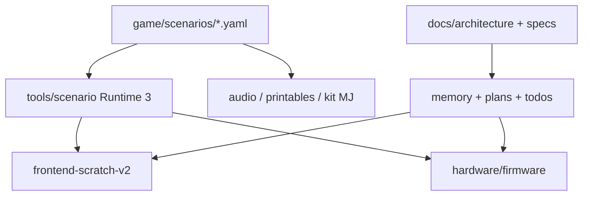

# Repository Structure

## Canon de refonte

## Répertoires principaux
- `.github/`: CI et politiques de validation.
- `audio/`: manifestes et ressources audio.
- `docs/`: quickstart, architecture, benchmark OSS, runbooks.
- `frontend-scratch-v2/`: studio auteur React + Blockly et prévisualisation Runtime 3.
- `game/`: scénarios YAML canoniques.
- `hardware/`: firmware, scripts de test terrain et documentation matériel.
- `kit-maitre-du-jeu/`: déroulé MJ, organisation des stations, scripts de partie.
- `memory/`: mémoire projet transversale.
- `plans/`: plans directeurs et plans d'agents.
- `printables/`: manifestes et sources d'indices imprimables.
- `specs/`: spécifications canoniques de la refonte.
- `todos/`: backlog opérationnel de la refonte.
- `tools/`: validateurs, compilateur/simulateur Runtime 3, shells TUI/CLI.

## Règles de structure
- `game/scenarios/*.yaml` reste la source de vérité narrative.
- `hardware/firmware/esp32/` est en lecture seule.
- `frontend-scratch-v2/` est le front canonique; les chemins legacy doivent sortir du flux principal.
- Les artefacts d'exécution restent hors git et sont référencés depuis les TODO ou rapports.

## Chemins de référence
- Architecture: `docs/architecture/index.md`
- Runtime: `specs/ZACUS_RUNTIME_3_SPEC.md`
- Studio: `specs/STORY_DESIGNER_SCRATCH_LIKE_SPEC.md`
- Pilotage: `plans/master-plan.md`, `todos/master.md`
