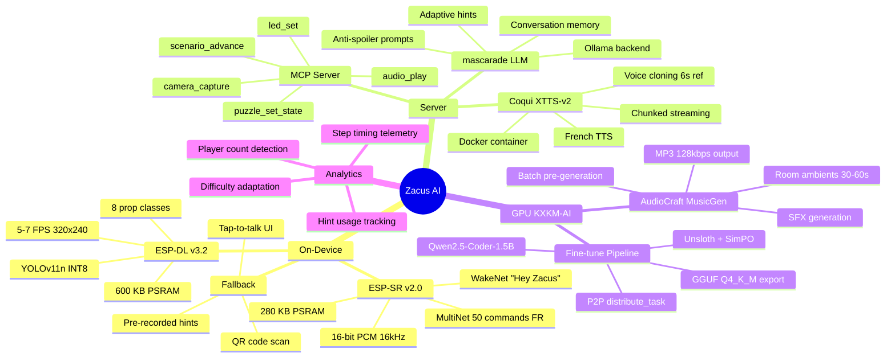
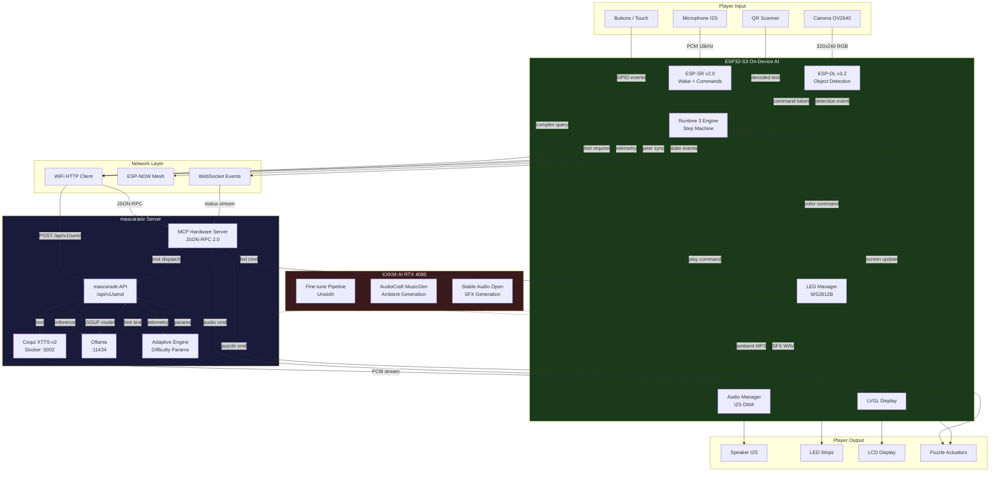
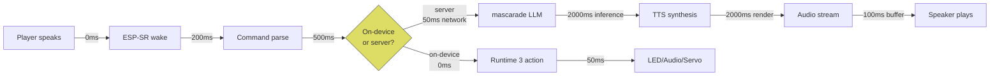
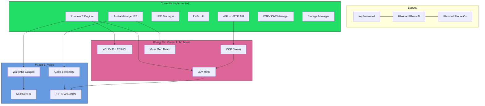

# AI Integration Map

## Mindmap — AI Capabilities

## Flowchart — Data Flows

## Latency Map

**Critical path (voice hint)**: 200 + 500 + 50 + 2000 + 2000 + 100 = ~4850 ms worst case, target < 3000 ms.

## Component Integration Matrix

## Notes
- On-device AI (ESP-SR, ESP-DL) runs without network — zero-latency fallback.
- Server AI (LLM, TTS, MCP) requires WiFi — graceful degradation to cached hints.
- GPU AI (AudioCraft) is offline batch only — no runtime dependency.
- All AI features are additive: the base Runtime 3 game works without any AI.
