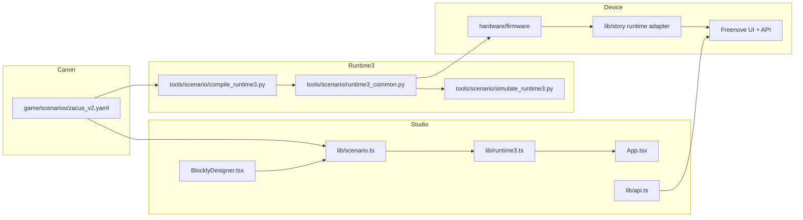

# Component Map

## Notes
- The React studio owns authoring ergonomics and previews.
- The Python compiler/simulator owns deterministic offline validation.
- Firmware consumes the Runtime 3 contract and exposes runtime APIs.
