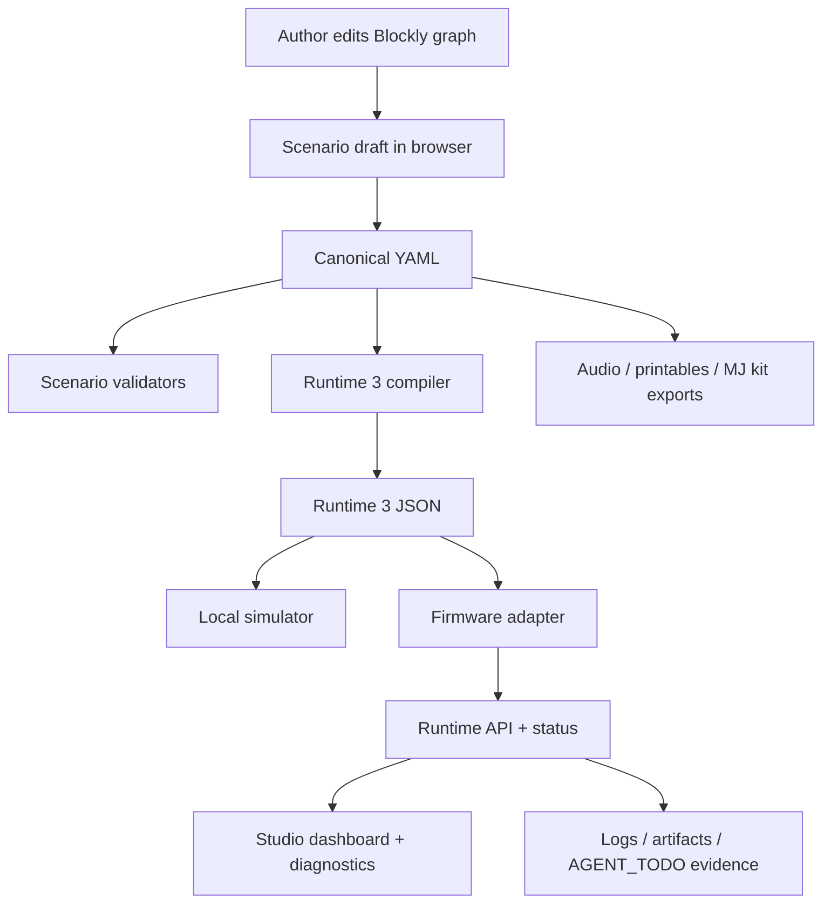

# Data Flow Map

## Guarantees
- Narrative truth remains in YAML during the migration window.
- Runtime truth is emitted as versioned IR JSON.
- Hardware evidence stays outside git and is referenced from planning/TODO docs.
