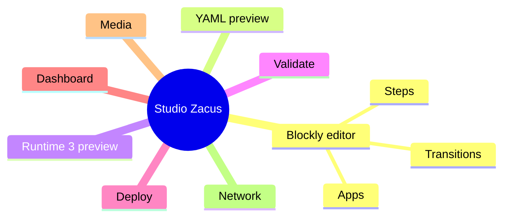

# Feature Map

## Core Gameplay Features

| Feature | Canon input | Runtime pivot | Delivery surfaces |
| --- | --- | --- | --- |
| LA 440 stabilization | `puzzles.PUZZLE_LA_440` | `STEP_LA_DETECTOR` | studio, firmware, audio, GM kit |
| LEFOU piano unlock | `puzzles.PUZZLE_PIANO_ALPHABET_5` | `STEP_LEFOU_DETECTOR` | studio, firmware, printables, GM kit |
| QR WIN finale | `puzzles.PUZZLE_QR_WIN` | `STEP_QR_DETECTOR` | studio, firmware camera, archives setup |
| Media hub / finale | `firmware.media_hub` | `SCENE_MEDIA_MANAGER` | firmware, studio dashboard |

## Authoring Features

## Refactor Priorities
1. Authoring parity with the current canonical scenario.
2. Runtime 3 compilation and simulation.
3. Combined-board execution on Freenove.
4. Documentation and cleanup of legacy references.
