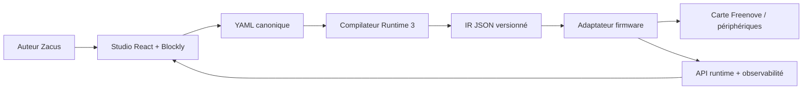

# Zacus Architecture

Cette section est le point d’entrée canonique de la refonte Zacus V3.

## Vue d’ensemble
- Le contenu narratif reste défini dans `game/scenarios/*.yaml`.
- Le studio auteur canonique est `frontend-scratch-v2/`.
- Le nouveau noyau cible est **Zacus Runtime 3**, compilé en IR JSON.
- Le firmware devient un adaptateur d’exécution et d’API.

## Cartes publiées
- [System Map](system-map.md)
- [Component Map](component-map.md)
- [Data Flow Map](data-flow-map.md)
- [Feature Map](feature-map.md)
- [Migration Map](migration-map.md)
- [Agent Matrix](agent-matrix.md)
- [Release Map](release-map.md)

## Principe directeur
Une seule architecture visible:

