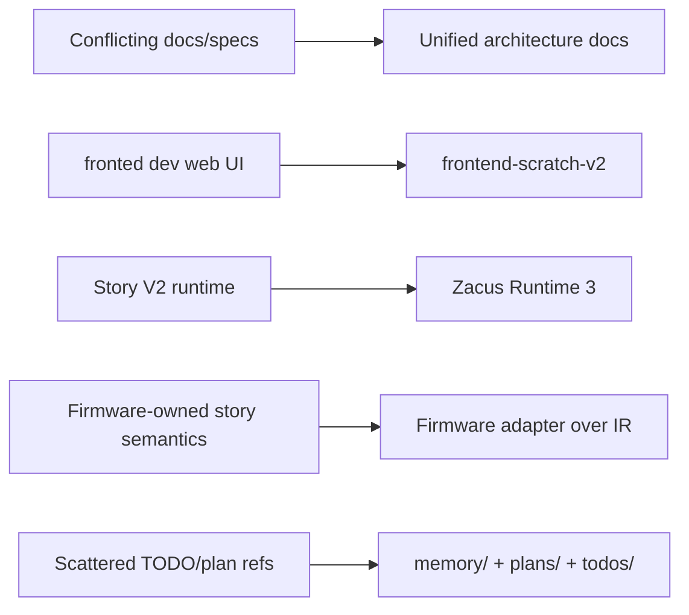

# Migration Map

## Migration Route

## Rules
- No destructive cleanup before replacement proof.
- Legacy routes are quarantined first, then removed.
- Hardware evidence stays in `hardware/firmware/docs/AGENT_TODO.md` until the adapter route is stable.

## Current Quarantine Targets
- `fronted dev web UI/`
- Svelte/Cytoscape specs and references
- `zacus_v1` references outside archive or historical context
- duplicate docs such as `docs/AGENTS 2.md` and `docs/AGENT_TODO 2.md`
