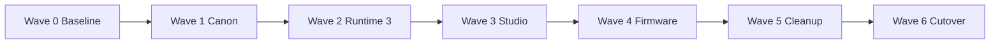

# Release Map

## Exit Criteria
- Wave 0: baseline evidence captured and dirty-tree risks understood.
- Wave 1: architecture/spec/docs/plans canonized.
- Wave 2: Runtime 3 compiler and simulator usable on the canonical scenario.
- Wave 3: React/Blockly studio builds and previews Runtime 3.
- Wave 4: Freenove build path consumes the runtime contract without regression.
- Wave 5: legacy paths archived or deleted with proof of replacement.
- Wave 6: README, docs site, CI, and operator entrypoints all point to the new canon.
