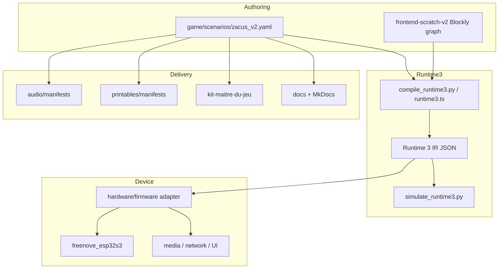

# System Map

## Canonical System

## Design Notes
- YAML stays canonical for narrative truth during migration.
- Blockly is the preferred authoring UX, not the runtime artifact itself.
- Runtime 3 IR is the portable contract between authoring and execution.
- Firmware owns board integration, not story semantics.
