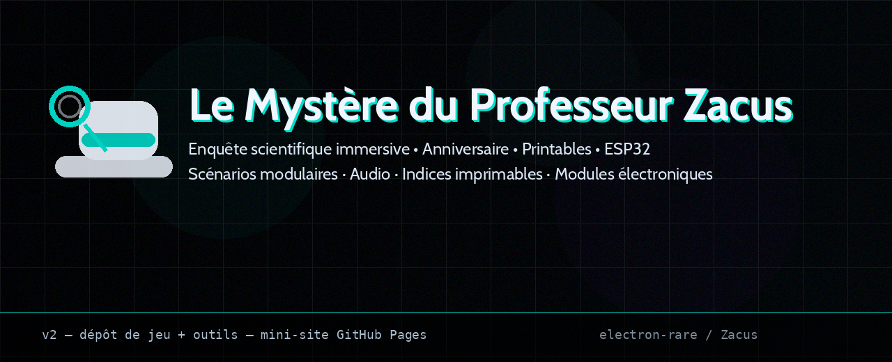
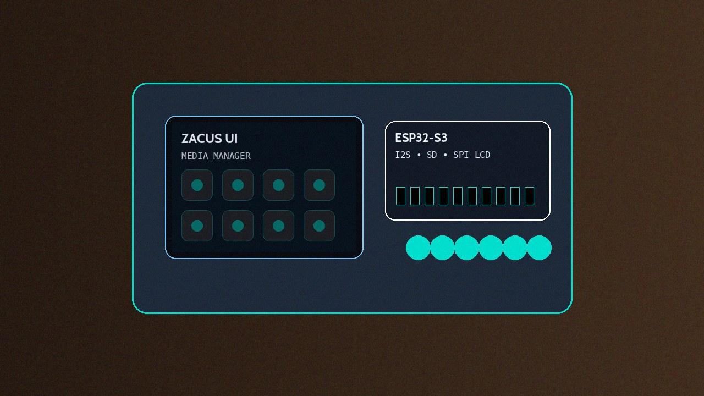
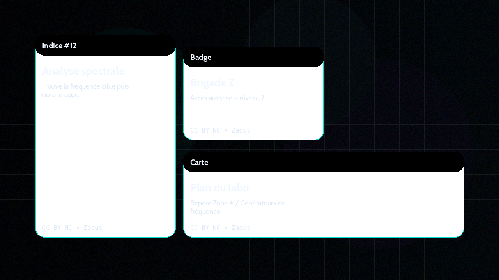
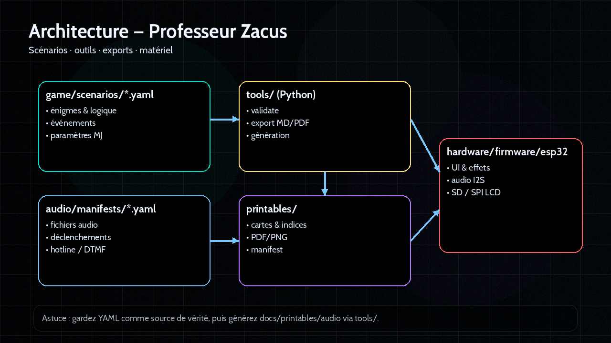

# 🎩 Le Mystère du Professeur Zacus



Le Mystère du Professeur Zacus : une enquête scientifique immersive pour anniversaire, jouable en famille ou entre ami·e·s.

Scénarios modulaires (YAML), supports imprimables, audio, et accessoires électroniques (ESP32/Arduino).

<div class="badges">
  <div class="badge">Scénarios modulaires</div>
  <div class="badge">Audio & checkpoints</div>
  <div class="badge">Modules électroniques</div>
  <div class="badge">Thème labo/science</div>
</div>

---

## Structure du projet

```text
├── game/scenarios/*.yaml          Scénarios (source de vérité)
├── audio/manifests/*.yaml         Manifeste audio + fichiers associés
├── printables/manifests/*.yaml    Manifeste printables + PDF/PNG
├── hardware/firmware/esp32/       Firmware (lecture seule sans approbation)
├── tools/                         Outils Python (validation, export, génération)
├── docs/                          Guides + mini-site GitHub Pages
├── assets/                        Images (README / marketing)
```

---

## Démarrage rapide

1. Imprime les printables (cartes, indices).
2. (Option) Flash les modules électroniques.
3. Lis le scénario YAML et place les indices.
4. Lance la partie et suis le guide MJ.

---

## Guides & documentation

- [STRUCTURE.md](STRUCTURE.md) : Architecture détaillée
- [QUICKSTART.md](QUICKSTART.md) : Démarrage express
- [WORKFLOWS.md](WORKFLOWS.md) : Workflows validation/export
- [faq.md](faq.md) : FAQ dépannage

---

## Licences

- Code : MIT — voir [../LICENSE](../LICENSE)
- Contenu créatif : CC BY‑NC 4.0 — voir [../LICENSE-CONTENT.md](../LICENSE-CONTENT.md)

---

## Assets

- Couverture : assets/cover.png
- OpenGraph : assets/og.png
- Poster : assets/poster.png
- Logo : assets/logo.png
- Diagramme : assets/diagram.png
- Aperçu printables : assets/printables.png

## Démo


---

## Jouer (MJ)

### Checklist rapide
1. Imprime les **printables** (cartes, indices).
2. (Option) Flash les modules électroniques.
3. Lis le scénario et place les indices.
4. Lance la partie et suis le guide MJ.

👉 Voir aussi : [FAQ (flash / SD / audio)](./faq)

---

## Développer / contribuer

### Structure du dépôt
- `game/scenarios/` — scénarios (source de vérité)
- `audio/` — manifestes et ressources audio
- `printables/` — manifestes + PDF/PNG
- `tools/` — outils Python (validation, export)
- `hardware/firmware/esp32/` — firmware (**lecture seule** sans approbation)

### Démarrage rapide
```bash
python3 -m pip install -r tools/requirements.txt
python3 tools/scenario/validate_scenario.py game/scenarios/mon_scenario.yaml
```

---

## Visuels & matériel







---

## Licences
- **Code** : MIT (`LICENSE`)
- **Contenu** : CC BY‑NC 4.0 (`LICENSE-CONTENT.md`)
