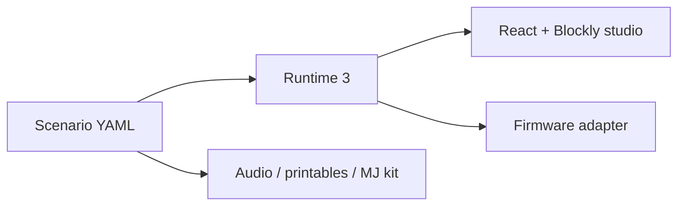

# Zacus V3

Point d'entrée documentaire de la refonte Zacus.

## Canon
- YAML source de vérité: `game/scenarios/zacus_v2.yaml`
- Studio auteur: `frontend-scratch-v2/`
- Runtime portable: Zacus Runtime 3
- Cible terrain: Freenove ESP32-S3 via `hardware/firmware/`

## Démarrage
- [Quickstart](QUICKSTART.md)
- [Architecture](architecture/index.md)
- [Benchmark OSS](benchmark-oss.md)

## Carte rapide

```mermaid
flowchart LR
  YAML["Scenario YAML"] --> Runtime3["Runtime 3"]
  Runtime3 --> Studio["React + Blockly studio"]
  Runtime3 --> Firmware["Firmware adapter"]
  YAML --> Exports["Audio / printables / MJ kit"]
```

## Liens utiles
- [Repository Structure](STRUCTURE.md)
- Spécification Runtime 3: `specs/ZACUS_RUNTIME_3_SPEC.md`
- Spécification studio: `specs/STORY_DESIGNER_SCRATCH_LIKE_SPEC.md`
- Plans: `plans/master-plan.md`
- Todos: `todos/master.md`
