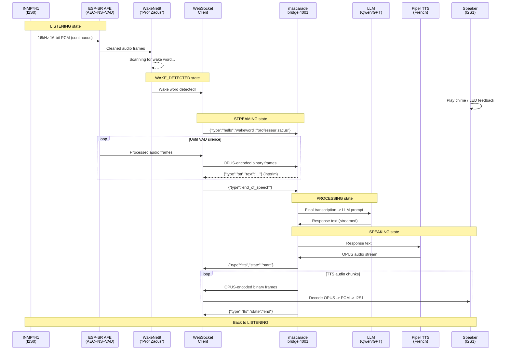

# Voice Pipeline Guide — Professeur Zacus

Technical guide for integrating voice interaction into the Zacus ESP32-S3 installation.

## Overview

The voice pipeline enables visitors to interact with Professeur Zacus using natural speech. The system uses a split architecture: wake word detection runs locally on the ESP32-S3 (via ESP-SR), while speech-to-text, LLM inference, and text-to-speech run server-side via the mascarade bridge.

## Hardware Requirements

### INMP441 MEMS Microphone

| INMP441 Pin | ESP32-S3 GPIO | Notes |
|-------------|---------------|-------|
| SCK (BCLK)  | GPIO 41       | I2S0 bit clock |
| WS (LRCLK)  | GPIO 42       | I2S0 word select |
| SD (DATA)   | GPIO 2        | I2S0 data in |
| L/R         | GND           | Left channel select |
| VDD         | 3.3V          | Power supply |
| GND         | GND           | Ground |

**Important:** The microphone uses I2S0, which is a separate bus from the speaker output on I2S1 (MAX98357A). Both can operate simultaneously for full-duplex audio.

### Speaker (already present)

The Freenove All-in-One board includes a MAX98357A I2S amplifier on I2S1. No additional wiring needed for audio output.

### Bill of Materials (voice-specific)

| Part | Qty | Approx. Cost | Source |
|------|-----|-------------|--------|
| INMP441 breakout | 1 | 3-5 EUR | AliExpress, Amazon |
| Dupont wires (F-F) | 5 | included | — |

## Software Requirements

### ESP-IDF + esp-sr Component

The ESP-SR library (WakeNet, MultiNet, AFE) requires the ESP-IDF framework. The current project uses Arduino framework via PlatformIO.

**Option A: Full migration to ESP-IDF (recommended for production)**

```ini
; platformio.ini changes
[env:freenove_allinone]
framework = espidf
; All Arduino-style code must be rewritten to ESP-IDF APIs
```

**Option B: Arduino as ESP-IDF component (gradual migration)**

```ini
; platformio.ini changes
[env:freenove_allinone]
framework = arduino, espidf
; Allows mixing Arduino and ESP-IDF code
; esp-sr can be added as an IDF component
```

### esp-sr Component Registration

Create or update `idf_component.yml`:
```yaml
dependencies:
  espressif/esp-sr:
    version: "^1.0.0"
    # Includes: WakeNet, MultiNet, AFE (AEC + NS + VAD)
```

### Partition Table

ESP-SR models need flash space. Update `partitions.csv`:
```
# Name,   Type, SubType, Offset,  Size,    Flags
model,    data, spiffs,  ,        1500K,   ; WakeNet + optional MultiNet models
```

## Voice Flow — Sequence Diagram



## XiaoZhi WebSocket Protocol

The voice pipeline follows the [XiaoZhi-ESP32](https://github.com/78/xiaozhi-esp32) WebSocket protocol, which is well-documented and battle-tested.

### Client -> Server Messages

| Type | Format | Description |
|------|--------|-------------|
| Hello | `{"type":"hello","version":1,"wakeword":"..."}` | Session start after wake detection |
| Audio | Binary (OPUS frames) | 20ms OPUS-encoded audio at 16kHz mono |
| Abort | `{"type":"abort"}` | Cancel current interaction |
| End of speech | `{"type":"end_of_speech"}` | VAD detected end of utterance |

### Server -> Client Messages

| Type | Format | Description |
|------|--------|-------------|
| STT result | `{"type":"stt","text":"..."}` | Interim/final transcription |
| LLM text | `{"type":"llm","text":"...","emotion":"..."}` | Streamed LLM response |
| TTS control | `{"type":"tts","state":"start\|end"}` | TTS playback boundaries |
| TTS audio | Binary (OPUS frames) | OPUS-encoded speech audio |
| Emotion | `{"type":"emotion","value":"happy\|thinking\|..."}` | Facial expression hint |

### Audio Encoding

- **Codec:** OPUS (RFC 6716)
- **Frame size:** 20ms
- **Sample rate:** 16kHz
- **Channels:** Mono
- **Bitrate:** ~16kbps (voice-optimized)
- **Library:** `libopus` via ESP-IDF component or bundled in esp-sr

## Server-Side Requirements

### mascarade Bridge Endpoint

The mascarade bridge (running on GrosMac or VM) needs a `/voice` WebSocket endpoint that:

1. Receives OPUS audio frames from ESP32
2. Decodes OPUS -> PCM
3. Runs STT (Whisper via faster-whisper or whisper.cpp)
4. Sends transcription to LLM pipeline (existing mascarade flow)
5. Sends LLM response text to TTS
6. Encodes TTS output as OPUS
7. Streams OPUS frames back to ESP32

This endpoint does not exist yet in mascarade. It will be added as a new route in the bridge service.

### TTS Services

Two TTS options are provided via Docker Compose (`tools/dev/docker-compose.tts.yml`):

**Piper TTS (recommended for low latency)**
- CPU-only, runs on VM (192.168.0.119)
- French voice: `fr_FR-siwis-medium` or `fr_FR-upmc-medium`
- Latency: ~200ms for short sentences
- OpenAI-compatible API on port 8000

**Coqui XTTS-v2 (for voice cloning)**
- GPU required, deploy on KXKM-AI (RTX 4090)
- Can clone Professeur Zacus's voice from ~30s of sample audio
- Higher quality but higher latency (~1-2s)
- API on port 5002

### STT Service

- **Recommended:** faster-whisper with `large-v3` model
- **Language:** French (`--language fr`)
- **Deploy on:** KXKM-AI for GPU inference, or VM for CPU (slower)
- **Alternative:** whisper.cpp for CPU-optimized inference

## Custom Wake Word — Espressif Process

To get a custom "Professeur Zacus" wake word model for WakeNet9:

1. **Contact Espressif** via https://www.espressif.com/en/contact-us
2. **Provide:**
   - Target phrase: "Professeur Zacus"
   - Language: French
   - 200+ audio recordings of the phrase (diverse speakers, environments)
   - Target platform: ESP32-S3 with WakeNet9
3. **Timeline:** 2-4 weeks
4. **Cost:** Varies (may be free for open-source/educational projects)
5. **Delivery:** `.wn9` model file to flash to partition

### Recording Tips for Training Data

- Record in the target environment (exhibition space)
- Include male/female voices, different ages
- Include background noise variations
- Record at 16kHz, 16-bit, mono WAV
- Minimum 200 recordings, ideally 500+
- Use the INMP441 mic itself for best acoustic match

## French Voice Command Strategy

**Local MultiNet is NOT recommended for French** because:
- MultiNet only supports Chinese, English, and a few other languages
- French phonetics are complex (liaisons, nasals, silent letters)
- Limited command vocabulary even in supported languages

**Strategy: Server-side ASR for all speech recognition**

1. Wake word detection: Local (WakeNet9, language-agnostic acoustic model)
2. All speech-to-text: Server-side via Whisper (excellent French support)
3. Intent parsing: LLM-based via mascarade (natural language understanding)
4. No local MultiNet needed — everything after wake word goes to server

This simplifies the ESP32 firmware (no MultiNet model in flash) and gives unlimited French vocabulary through the LLM.

## Migration Path — Arduino to ESP-IDF

### Phase 1: Scaffold (current)
- Voice pipeline header + stubs in Arduino framework
- No ESP-SR dependency
- Compiles and runs (functions return safe defaults)

### Phase 2: Arduino-as-Component
- Switch PlatformIO to `framework = arduino, espidf`
- Add esp-sr as IDF component
- Implement I2S mic input and AFE initialization
- Test wake word detection with "Hi Lexin" placeholder
- Keep all existing Arduino code unchanged

### Phase 3: WebSocket Streaming
- Add OPUS encoder (IDF component)
- Implement WebSocket client for mascarade bridge
- Stream audio on wake detection
- Receive and play TTS responses

### Phase 4: Production
- Order custom "Professeur Zacus" wake word
- Full ESP-IDF migration (optional, for memory optimization)
- AEC tuning (echo cancellation between speaker and mic)
- LED/display feedback during voice states

## Memory Budget

| Component | RAM Type | Size | Notes |
|-----------|----------|------|-------|
| WakeNet9 | PSRAM | ~340 KB | Single wake word model |
| AFE (1ch) | PSRAM | ~1.1 MB | AEC + noise suppression + VAD |
| OPUS codec | Internal | ~50 KB | Encoder + decoder |
| Audio buffers | PSRAM | ~64 KB | Ring buffers for I2S + WebSocket |
| **Total voice** | **Mixed** | **~1.5 MB** | |
| LVGL + UI | PSRAM | ~2 MB | Existing allocation |
| Camera | PSRAM | ~500 KB | JPEG buffer |
| **System total** | **PSRAM** | **~4 MB** | Of 8 MB available |

## File Structure

```
ESP32_ZACUS/ui_freenove_allinone/
├── include/voice/
│   └── voice_pipeline.h          # Public API (this scaffold)
├── src/voice/
│   └── voice_pipeline.cpp        # Stub implementation
└── ...

docs/voice/
└── VOICE_PIPELINE_GUIDE.md       # This document

tools/dev/
└── docker-compose.tts.yml        # TTS services (Piper + XTTS-v2)
```

## References

- [XiaoZhi-ESP32](https://github.com/78/xiaozhi-esp32) — Open-source voice assistant for ESP32-S3
- [ESP-SR Programming Guide](https://docs.espressif.com/projects/esp-sr/en/latest/) — WakeNet, MultiNet, AFE
- [Piper TTS](https://github.com/rhasspy/piper) — Fast local TTS with French models
- [Coqui XTTS-v2](https://github.com/coqui-ai/TTS) — Voice cloning TTS
- [faster-whisper](https://github.com/guillaumekln/faster-whisper) — CTranslate2-based Whisper
- [OPUS codec](https://opus-codec.org/) — Low-latency audio codec
