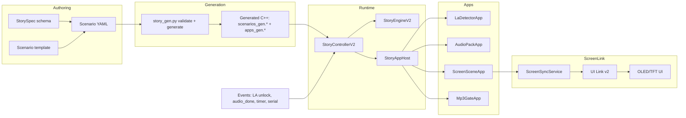

# Story V2 Pipeline (UML + Flow)

Story V2 is an event-driven state machine generated from YAML specs and executed by StoryEngineV2, with apps driving audio, screen, and MP3 gate behavior.

## Pipeline overview



## Core model (simplified UML)

```
StoryEngineV2
  + loadScenario(scenario)
  + start(scenarioId, nowMs)
  + update(nowMs)
  + postEvent(event)
  + jumpToStep(stepId, reason, nowMs)
  + snapshot()
  + lastError()

ScenarioDef
  + id
  + version
  + steps[]
  + stepCount
  + initialStepId

StepDef
  + id
  + resources: ResourceBindings
  + transitions[]
  + transitionCount
  + mp3GateOpen

ResourceBindings
  + screenSceneId
  + audioPackId
  + actionIds[]
  + actionCount
  + appIds[]
  + appCount

TransitionDef
  + id
  + trigger: kOnEvent | kAfterMs | kImmediate
  + eventType
  + eventName
  + afterMs
  + targetStepId
  + priority

StoryEvent
  + type
  + name
  + value
  + atMs

StoryEventQueue
  + push(event)
  + pop(outEvent)
  + size()
  + droppedCount()
```

## App layer around the engine

```
StoryAppHost
  + begin(context)
  + startStep(scenario, step)
  + update(nowMs, sink)
  + handleEvent(event, sink)
  + validateScenario(scenario)

StoryApp (abstract)
  + begin(context)
  + start(stepContext)
  + update(nowMs, sink)
  + stop(reason)
  + handleEvent(event, sink)
  + snapshot()

Apps:
  - LaDetectorApp
  - AudioPackApp
  - ScreenSceneApp
  - Mp3GateApp
```

## LA detector integration (Story V2)

```
LaDetectorApp
  + start(stepContext)
  + update(nowMs, sink)
  + emits StoryEvent kUnlock (unlock_event)
  + config: hold_ms, unlock_event, require_listening

LaDetectorRuntimeService
  + start(config, nowMs)
  + update(nowMs)
  + snapshot()
  + consumeUnlock()

StoryAppHost
  + wires LaDetectorApp -> LaDetectorRuntimeService
```

## References

- Full pipeline doc: docs/protocols/STORY_V2_PIPELINE.md
- Specs: docs/protocols/story_specs
- Generator: esp32_audio/tools/story_gen/story_gen.py
- Runtime: esp32_audio/src/controllers/story/story_controller_v2.cpp
- Engine: esp32_audio/src/story/core/story_engine_v2.cpp
