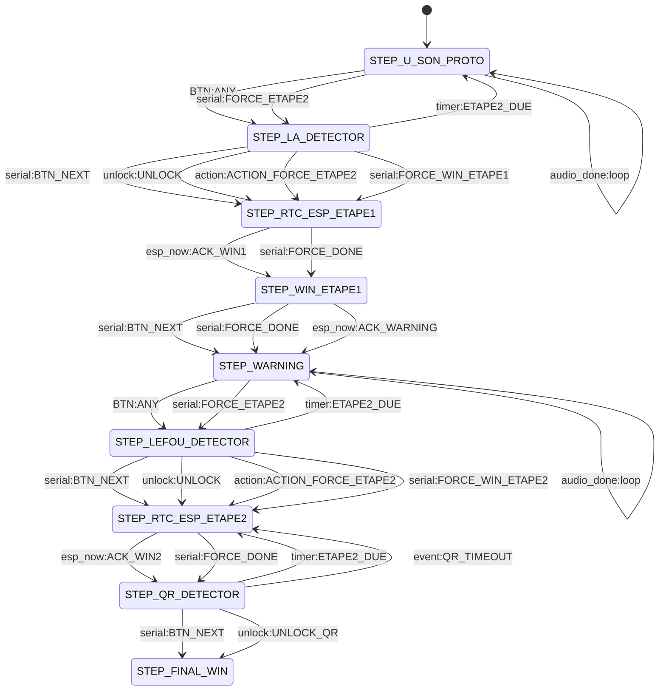

# Zacus FSM — Mermaid diagram (runtime DEFAULT)

```mermaid
stateDiagram-v2
  [*] --> STEP_U_SON_PROTO

  STEP_U_SON_PROTO --> STEP_U_SON_PROTO: audio_done:loop
  STEP_U_SON_PROTO --> STEP_LA_DETECTOR: BTN:ANY
  STEP_U_SON_PROTO --> STEP_LA_DETECTOR: serial:FORCE_ETAPE2

  STEP_LA_DETECTOR --> STEP_U_SON_PROTO: timer:ETAPE2_DUE
  STEP_LA_DETECTOR --> STEP_RTC_ESP_ETAPE1: serial:BTN_NEXT
  STEP_LA_DETECTOR --> STEP_RTC_ESP_ETAPE1: unlock:UNLOCK
  STEP_LA_DETECTOR --> STEP_RTC_ESP_ETAPE1: action:ACTION_FORCE_ETAPE2
  STEP_LA_DETECTOR --> STEP_RTC_ESP_ETAPE1: serial:FORCE_WIN_ETAPE1

  STEP_RTC_ESP_ETAPE1 --> STEP_WIN_ETAPE1: esp_now:ACK_WIN1
  STEP_RTC_ESP_ETAPE1 --> STEP_WIN_ETAPE1: serial:FORCE_DONE

  STEP_WIN_ETAPE1 --> STEP_WARNING: serial:BTN_NEXT
  STEP_WIN_ETAPE1 --> STEP_WARNING: serial:FORCE_DONE
  STEP_WIN_ETAPE1 --> STEP_WARNING: esp_now:ACK_WARNING

  STEP_WARNING --> STEP_WARNING: audio_done:loop
  STEP_WARNING --> STEP_LEFOU_DETECTOR: BTN:ANY
  STEP_WARNING --> STEP_LEFOU_DETECTOR: serial:FORCE_ETAPE2

  STEP_LEFOU_DETECTOR --> STEP_WARNING: timer:ETAPE2_DUE
  STEP_LEFOU_DETECTOR --> STEP_RTC_ESP_ETAPE2: serial:BTN_NEXT
  STEP_LEFOU_DETECTOR --> STEP_RTC_ESP_ETAPE2: unlock:UNLOCK
  STEP_LEFOU_DETECTOR --> STEP_RTC_ESP_ETAPE2: action:ACTION_FORCE_ETAPE2
  STEP_LEFOU_DETECTOR --> STEP_RTC_ESP_ETAPE2: serial:FORCE_WIN_ETAPE2

  STEP_RTC_ESP_ETAPE2 --> STEP_QR_DETECTOR: esp_now:ACK_WIN2
  STEP_RTC_ESP_ETAPE2 --> STEP_QR_DETECTOR: serial:FORCE_DONE

  STEP_QR_DETECTOR --> STEP_RTC_ESP_ETAPE2: timer:ETAPE2_DUE
  STEP_QR_DETECTOR --> STEP_RTC_ESP_ETAPE2: event:QR_TIMEOUT
  STEP_QR_DETECTOR --> STEP_FINAL_WIN: serial:BTN_NEXT
  STEP_QR_DETECTOR --> STEP_FINAL_WIN: unlock:UNLOCK_QR
```
