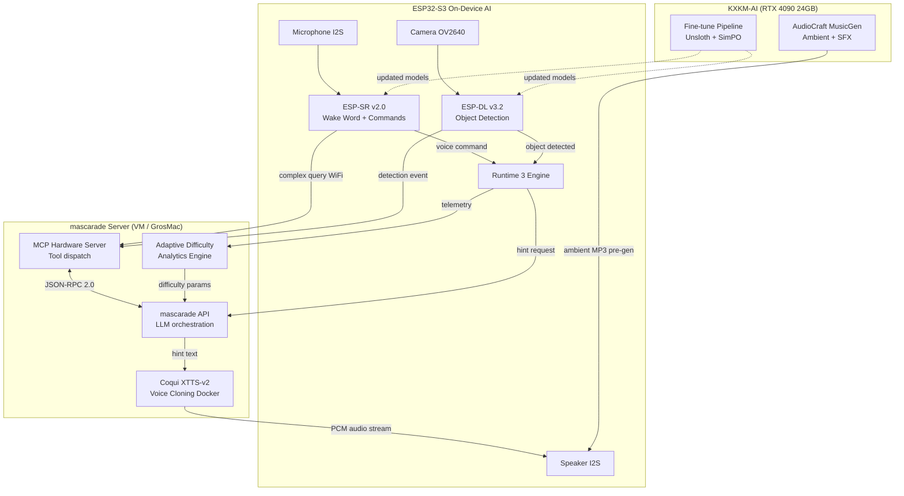
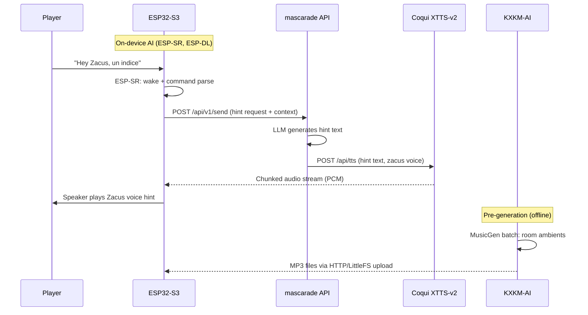

# AI Integration Specification

## Status
- State: draft
- Date: 2026-03-21
- Depends on: `ZACUS_RUNTIME_3_SPEC.md`, `MCP_HARDWARE_SERVER_SPEC.md`, `FIRMWARE_WEB_DATA_CONTRACT.md`

## 1) Objective

Integrate AI capabilities into the Zacus escape room platform across three tiers:
- **On-device** (ESP32-S3): low-latency voice commands and object detection
- **Server** (mascarade + Docker): LLM reasoning, TTS voice cloning, MCP orchestration
- **GPU** (KXKM-AI RTX 4090): generative audio, model fine-tuning

The AI layer enriches the escape room without replacing the deterministic Runtime 3 scenario engine. AI features degrade gracefully: if the server is unreachable, the game continues with pre-recorded audio and static hints.

## 2) Architecture Overview



## 3) On-Device AI

### 3.1 ESP-SR v2.0 — Wake Word + Voice Commands

**Purpose**: Hands-free interaction during gameplay. Players say "Hey Zacus" then a command.

| Parameter | Value |
|-----------|-------|
| Framework | ESP-SR v2.0 (WakeNet + MultiNet) |
| Wake word | "Hey Zacus" (custom trained, WakeNet Q8) |
| Command vocabulary | 50 French commands (MultiNet, expandable to 300) |
| Latency | < 200 ms wake detection, < 500 ms command recognition |
| Memory | ~280 KB PSRAM (WakeNet 120 KB + MultiNet 160 KB) |
| Audio format | 16-bit PCM, 16 kHz, mono |
| Microphone | INMP441 I2S MEMS |

**Command categories**:
- Navigation: "indice", "aide", "repeter", "suivant"
- Puzzle control: "valider", "annuler", "recommencer"
- Meta: "temps restant", "score", "pause"

**Fallback**: If wake word detection fails 3 times, the UI displays a tap-to-talk button.

### 3.2 ESP-DL v3.2 — Object Detection

**Purpose**: Detect physical puzzle props placed in front of the camera.

| Parameter | Value |
|-----------|-------|
| Framework | ESP-DL v3.2 |
| Model | YOLOv11n quantized (INT8) |
| Input | 320x240 RGB from OV2640 |
| FPS | 5-7 FPS inference |
| Memory | ~450 KB PSRAM (model) + 150 KB (input buffer) |
| Classes | 8 custom (fiole, clef, parchemin, cristal, engrenage, miroir, boussole, amulette) |
| Confidence threshold | 0.65 |

**Detection events**:
```json
{
  "event_type": "object_detected",
  "event_name": "DETECT_FIOLE",
  "class": "fiole",
  "confidence": 0.82,
  "bbox": [45, 60, 180, 220],
  "timestamp_ms": 1234567890
}
```

These events feed into Runtime 3 transitions like any other `event_type`.

### 3.3 Memory Budget (ESP32-S3, 8MB PSRAM)

| Component | PSRAM | Internal SRAM |
|-----------|-------|---------------|
| ESP-SR (WakeNet + MultiNet) | 280 KB | 12 KB |
| ESP-DL (YOLOv11n INT8) | 600 KB | 20 KB |
| LVGL UI | 96 KB | 8 KB |
| Audio DMA buffers | 64 KB | 4 KB |
| Runtime 3 engine | 48 KB | 16 KB |
| Network stack (WiFi + HTTP) | 80 KB | 32 KB |
| LittleFS cache | 32 KB | — |
| **Total used** | **1,200 KB** | **92 KB** |
| **Available** | 8,192 KB | 512 KB |
| **Headroom** | 85% | 82% |

### 3.4 Task Priority (FreeRTOS)

| Task | Priority | Core | Stack |
|------|----------|------|-------|
| Audio I2S (DMA) | 24 | 1 | 4 KB |
| ESP-SR inference | 20 | 1 | 8 KB |
| ESP-DL inference | 18 | 0 | 8 KB |
| Runtime 3 loop | 15 | 0 | 8 KB |
| LVGL tick | 12 | 0 | 4 KB |
| WiFi/HTTP | 10 | 0 | 6 KB |
| Idle | 0 | * | 2 KB |

## 4) Server-Side AI

### 4.1 Coqui XTTS-v2 — Voice Cloning

**Purpose**: Generate dynamic narration in Professor Zacus's voice.

| Parameter | Value |
|-----------|-------|
| Model | XTTS-v2 (Coqui) |
| Deployment | Docker container on mascarade VM |
| Reference sample | 6-second WAV of Zacus voice |
| Output format | PCM 22050 Hz 16-bit mono |
| Latency target | < 2 s for 20-word sentence |
| Language | French (fr) |
| Streaming | Chunked HTTP response (256-sample chunks) |
| GPU required | No (CPU inference acceptable for short utterances) |
| Memory | ~2 GB container |

**API endpoint** (Docker internal):
```
POST /api/tts
Content-Type: application/json

{
  "text": "Bravo, vous avez trouve la fiole sacree!",
  "speaker_wav": "/data/voices/zacus_ref.wav",
  "language": "fr"
}

Response: audio/wav stream
```

**Integration with mascarade**: The MCP server calls TTS after receiving hint text from the LLM. Audio is streamed to the ESP32 via chunked HTTP.

### 4.2 LLM Adaptive Hints via mascarade API

**Purpose**: Context-aware, anti-cheat hints personalized to player progress.

**Flow**:
1. ESP32 sends hint request with context (current step, elapsed time, failed attempts)
2. mascarade API routes to configured LLM provider
3. System prompt enforces anti-spoiler rules
4. Response text is sent to TTS for voice synthesis
5. Difficulty parameters adjust based on analytics

**Request format** (ESP32 -> mascarade):
```json
{
  "endpoint": "/api/v1/send",
  "payload": {
    "provider": "ollama",
    "model": "mascarade-coder",
    "messages": [
      {
        "role": "system",
        "content": "Tu es le Professeur Zacus. Donne un indice sans reveler la solution. Adapte le niveau: {{difficulty}}."
      },
      {
        "role": "user",
        "content": "Nous sommes bloques a l'etape {{step_id}} depuis {{elapsed_min}} minutes. Tentatives: {{attempts}}."
      }
    ]
  }
}
```

**Anti-cheat prompt engineering** (ref: devlinb/escaperoom):
- Never reveal full solutions
- Escalate hints progressively (vague -> specific -> near-answer)
- Maximum 3 hints per puzzle per session
- Log all hint requests for game master review

**Latency target**: < 3 s end-to-end (LLM + TTS + network).

### 4.3 MCP Hardware Server

See `MCP_HARDWARE_SERVER_SPEC.md` for full specification.

The MCP server exposes ESP32 hardware as LLM-callable tools:
- `puzzle_set_state` — lock/unlock puzzle elements
- `audio_play` — trigger audio on device speakers
- `led_set` — control LED strips (color, pattern, brightness)
- `camera_capture` — take a snapshot from OV2640
- `scenario_advance` — trigger a Runtime 3 transition

## 5) GPU AI (KXKM-AI)

### 5.1 AudioCraft MusicGen — Generative Audio

**Purpose**: Generate ambient music and sound effects per room/puzzle.

| Parameter | Value |
|-----------|-------|
| Model | MusicGen-small (300M) or MusicGen-medium (1.5B) |
| Hardware | KXKM-AI, RTX 4090 24 GB, 62 GB RAM |
| Generation mode | Pre-generation (not real-time) |
| Output format | WAV 32 kHz stereo, converted to MP3 128 kbps for ESP32 |
| Duration | 30-60 s loops per room |
| Prompt template | "atmospheric mysterious escape room music, {{room_theme}}, ambient, looping" |
| Latency | ~10 s per 30 s clip (offline batch) |

**Workflow**:
1. Game designer specifies room themes in scenario YAML
2. Batch generation script produces ambient tracks on KXKM-AI
3. Tracks are transcoded to MP3 128 kbps mono (ESP32 compatible)
4. Uploaded to LittleFS or served via HTTP
5. Runtime 3 `audio_pack_id` references generated tracks

**SFX generation** (Stable Audio Open):
- Short effect sounds (unlock, alarm, discovery)
- 2-5 s duration
- Triggered by Runtime 3 events

### 5.2 Fine-Tune Pipeline

| Parameter | Value |
|-----------|-------|
| Base model | Qwen2.5-Coder-1.5B |
| Method | Unsloth + SimPO |
| Dataset | Custom Zacus hint pairs + Magicoder-OSS-Instruct-75K |
| Training time | ~6 min on RTX 4090 |
| Output | GGUF Q4_K_M (~941 MB) deployed to Ollama on VM |
| Trigger | P2P `distribute_task` via mascarade mesh |

## 6) Data Flow Summary



## 7) Latency Targets

| Path | Target | Acceptable | Notes |
|------|--------|-----------|-------|
| Wake word detection | < 200 ms | < 500 ms | On-device, no network |
| Voice command recognition | < 500 ms | < 1 s | On-device, MultiNet |
| Object detection (single frame) | < 200 ms | < 400 ms | On-device, ESP-DL |
| LLM hint (text only) | < 2 s | < 4 s | Network + LLM inference |
| TTS synthesis (20 words) | < 2 s | < 4 s | Server CPU |
| End-to-end voice hint | < 3 s | < 6 s | Wake -> LLM -> TTS -> speaker |
| Ambient music start | < 500 ms | < 1 s | Pre-loaded MP3 |

## 8) Graceful Degradation

| Failure | Fallback |
|---------|----------|
| WiFi disconnected | Pre-recorded hints from LittleFS, no LLM |
| mascarade API down | Cached hint bank (3 hints per puzzle in JSON) |
| TTS service down | LLM text displayed on LVGL screen |
| ESP-SR model corrupt | Tap-to-talk UI button, no voice |
| ESP-DL model corrupt | QR code scanning fallback for object validation |
| KXKM-AI offline | Pre-generated ambient tracks already on device |

## 9) Phase Rollout Plan

### Phase A: Security Foundations (P0 — 1-2 weeks)
- NVS credential storage (replace hardcoded WiFi)
- Bearer token auth on all API endpoints
- Input validation + rate limiting
- LVGL pool increase 54 -> 96 KB
- Arduino stack increase 16 -> 24 KB

### Phase B: Voice Pipeline (P1 — 2-4 weeks)
1. Integrate ESP-SR v2.0 WakeNet custom wake word
2. Train "Hey Zacus" model with ESP-SR training toolkit
3. Deploy Coqui XTTS-v2 Docker on mascarade VM
4. Implement chunked audio streaming ESP32 <- Server
5. Add MultiNet command vocabulary (50 FR commands)
6. Reference architecture: XiaoZhi ESP32

### Phase C: Vision & Detection (P1 — 2-4 weeks)
1. Integrate ESP-DL v3.2 with quantized YOLOv11n
2. Collect and annotate prop dataset (8 classes, 500+ images)
3. Train custom model, export INT8 for ESP32
4. Wire detection events into Runtime 3 transitions
5. Face detection for player counting (ESP-WHO)

### Phase D: LLM Adaptive Hints (P2 — 4-6 weeks)
1. Design hint prompt templates with anti-spoiler rules
2. Implement hint request API in firmware HTTP client
3. Add analytics telemetry (step timing, attempts, hint count)
4. Build adaptive difficulty engine in mascarade
5. Professor Zacus as NPC LLM with conversation memory

### Phase E: Generative Audio (P2 — 2-3 weeks)
1. Deploy AudioCraft MusicGen on KXKM-AI
2. Create room theme prompts from scenario YAML
3. Batch generate ambient tracks (30-60 s loops)
4. Transcode to MP3 128 kbps mono for ESP32
5. SFX generation with Stable Audio Open

### Phase F: MCP & Orchestration (P3 — 4-6 weeks)
1. Implement MCP hardware server (see `MCP_HARDWARE_SERVER_SPEC.md`)
2. Register in mascarade MCP registry
3. Natural language hardware control for game masters
4. Real-time game master dashboard

## 10) Dependencies

| Dependency | Version | License | Source |
|------------|---------|---------|--------|
| ESP-SR | v2.0 | Espressif | espressif/esp-sr |
| ESP-DL | v3.2 | MIT | espressif/esp-dl |
| Coqui XTTS-v2 | latest | MPL-2.0 | coqui-ai/TTS |
| AudioCraft MusicGen | latest | MIT / CC-BY-NC-4.0 | facebookresearch/audiocraft |
| Stable Audio Open | latest | Stability AI CLA | stabilityai/stable-audio-open |
| mascarade API | main | Private | electron-rare/mascarade |
| Ollama | latest | MIT | ollama/ollama |
| Qwen2.5-Coder-1.5B | latest | Apache 2.0 | Qwen |
| Unsloth | latest | Apache 2.0 | unslothai/unsloth |
