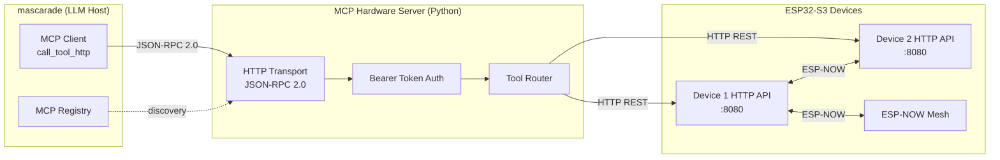
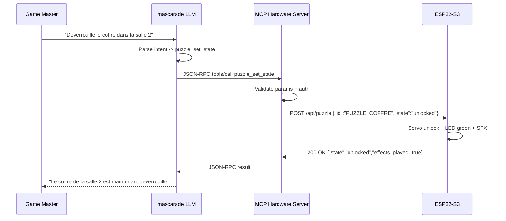
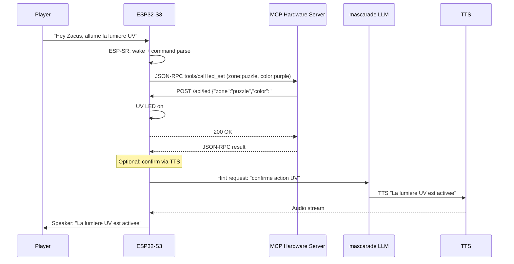

# MCP Hardware Server Specification

## Status
- State: draft
- Date: 2026-03-21
- Depends on: `AI_INTEGRATION_SPEC.md`, `FIRMWARE_WEB_DATA_CONTRACT.md`
- Reference: MCP specification (modelcontextprotocol.io), ESP RainMaker MCP pattern, IoT-MCP (Duke CEI)

## 1) Objective

Define an MCP (Model Context Protocol) server that exposes ESP32-S3 hardware capabilities as LLM-callable tools. This enables natural-language hardware control from mascarade, game master dashboards, and automated scenario orchestration.

## 2) Architecture



## 3) Transport

### 3.1 HTTP Transport (Primary)

The MCP server runs as a Python HTTP service registered in mascarade's MCP registry.

| Parameter | Value |
|-----------|-------|
| Protocol | JSON-RPC 2.0 over HTTP POST |
| Endpoint | `POST /mcp` |
| Port | 8790 (configurable via `MCP_HARDWARE_PORT`) |
| Content-Type | `application/json` |
| Auth | Bearer token (same as `MASCARADE_API_KEY`) |

### 3.2 stdio Transport (Local Development)

For local testing, the server also supports stdio transport per MCP spec:
```bash
python -m zacus_mcp_server --transport stdio
```

### 3.3 Registration in mascarade

```python
# mascarade MCP registry entry
{
    "name": "zacus-hardware",
    "description": "ESP32-S3 escape room hardware control",
    "transport": "http",
    "url": "http://localhost:8790/mcp",
    "auth": {"type": "bearer", "token_env": "MASCARADE_API_KEY"},
    "enabled_env": "ZACUS_MCP_ENABLED"
}
```

## 4) Authentication Model

### 4.1 MCP Server Auth (mascarade -> MCP Server)

- Bearer token in `Authorization` header
- Token matches `MASCARADE_API_KEY` environment variable
- Requests without valid token receive `401 Unauthorized`

### 4.2 MCP Server -> ESP32 Auth

- Bearer token in `Authorization` header on ESP32 HTTP API
- Token stored in ESP32 NVS (provisioned at setup)
- Per-device token support for multi-device deployments

### 4.3 Token Hierarchy

```
mascarade API key
  └── MCP server validates incoming requests
        └── Per-device ESP32 tokens
              └── ESP32 validates hardware commands
```

## 5) Tool Definitions

### 5.1 `puzzle_set_state`

Control puzzle lock/unlock state and trigger associated effects.

```json
{
  "name": "puzzle_set_state",
  "description": "Set the state of a puzzle element (lock, unlock, reset). Triggers associated LED and audio effects.",
  "inputSchema": {
    "type": "object",
    "properties": {
      "device_id": {
        "type": "string",
        "description": "Target ESP32 device identifier"
      },
      "puzzle_id": {
        "type": "string",
        "description": "Puzzle identifier from scenario runtime",
        "enum": ["PUZZLE_FIOLE", "PUZZLE_COFFRE", "PUZZLE_MIROIR", "PUZZLE_ENGRENAGE", "PUZZLE_CRYSTAL", "PUZZLE_BOUSSOLE"]
      },
      "state": {
        "type": "string",
        "enum": ["locked", "unlocked", "reset"],
        "description": "Target state"
      },
      "effects": {
        "type": "boolean",
        "default": true,
        "description": "Play associated LED/audio effects on state change"
      }
    },
    "required": ["device_id", "puzzle_id", "state"]
  }
}
```

**ESP32 API mapping**: `POST /api/puzzle` with body `{"id": "...", "state": "...", "effects": true}`

### 5.2 `audio_play`

Play audio files or streams on device speakers.

```json
{
  "name": "audio_play",
  "description": "Play an audio file or stream on the ESP32 speaker. Supports local files (LittleFS) and HTTP URLs.",
  "inputSchema": {
    "type": "object",
    "properties": {
      "device_id": {
        "type": "string",
        "description": "Target ESP32 device identifier"
      },
      "source": {
        "type": "string",
        "description": "Audio source: LittleFS path (/audio/hint_01.mp3) or HTTP URL"
      },
      "volume": {
        "type": "integer",
        "minimum": 0,
        "maximum": 100,
        "default": 70,
        "description": "Playback volume (0-100)"
      },
      "loop": {
        "type": "boolean",
        "default": false,
        "description": "Loop playback continuously"
      },
      "action": {
        "type": "string",
        "enum": ["play", "stop", "pause", "resume"],
        "default": "play"
      }
    },
    "required": ["device_id", "source"]
  }
}
```

**ESP32 API mapping**: `POST /api/audio` with body `{"src": "...", "vol": 70, "loop": false, "action": "play"}`

### 5.3 `led_set`

Control LED strips and individual LEDs.

```json
{
  "name": "led_set",
  "description": "Control LED strips: set color, pattern, brightness. Supports WS2812B addressable LEDs.",
  "inputSchema": {
    "type": "object",
    "properties": {
      "device_id": {
        "type": "string",
        "description": "Target ESP32 device identifier"
      },
      "zone": {
        "type": "string",
        "description": "LED zone identifier",
        "enum": ["ambient", "puzzle", "alert", "all"]
      },
      "color": {
        "type": "string",
        "description": "Hex color (#RRGGBB) or named color",
        "pattern": "^(#[0-9a-fA-F]{6}|red|green|blue|white|off|warm|cold|purple|orange)$"
      },
      "pattern": {
        "type": "string",
        "enum": ["solid", "breathe", "chase", "rainbow", "pulse", "off"],
        "default": "solid"
      },
      "brightness": {
        "type": "integer",
        "minimum": 0,
        "maximum": 255,
        "default": 128
      },
      "duration_ms": {
        "type": "integer",
        "description": "Auto-off after duration (0 = indefinite)",
        "default": 0
      }
    },
    "required": ["device_id", "zone", "color"]
  }
}
```

**ESP32 API mapping**: `POST /api/led` with body `{"zone": "...", "color": "...", "pattern": "solid", "bright": 128}`

### 5.4 `camera_capture`

Capture a snapshot from the OV2640 camera.

```json
{
  "name": "camera_capture",
  "description": "Capture a JPEG snapshot from the ESP32 camera. Returns base64-encoded image.",
  "inputSchema": {
    "type": "object",
    "properties": {
      "device_id": {
        "type": "string",
        "description": "Target ESP32 device identifier"
      },
      "resolution": {
        "type": "string",
        "enum": ["QQVGA", "QVGA", "VGA"],
        "default": "QVGA",
        "description": "Capture resolution (160x120, 320x240, 640x480)"
      },
      "quality": {
        "type": "integer",
        "minimum": 10,
        "maximum": 63,
        "default": 20,
        "description": "JPEG quality (lower = better, 10-63)"
      }
    },
    "required": ["device_id"]
  }
}
```

**ESP32 API mapping**: `GET /api/camera?res=QVGA&q=20` returns `image/jpeg`

### 5.5 `scenario_advance`

Trigger a Runtime 3 transition on the device.

```json
{
  "name": "scenario_advance",
  "description": "Trigger a Runtime 3 scenario transition. Used by game masters to manually advance or reset the game.",
  "inputSchema": {
    "type": "object",
    "properties": {
      "device_id": {
        "type": "string",
        "description": "Target ESP32 device identifier"
      },
      "event_type": {
        "type": "string",
        "enum": ["button", "serial", "timer", "audio_done", "unlock", "espnow", "action", "manual"],
        "description": "Event type per Runtime 3 transition model"
      },
      "event_name": {
        "type": "string",
        "description": "Event name token (e.g., UNLOCK_COFFRE, MANUAL_ADVANCE)"
      },
      "target_step_id": {
        "type": "string",
        "description": "Optional: force transition to specific step (game master override)"
      }
    },
    "required": ["device_id", "event_type", "event_name"]
  }
}
```

**ESP32 API mapping**: `POST /api/scenario/transition` with body `{"event_type": "...", "event_name": "...", "target": "..."}`

### 5.6 `device_status`

Query device health and current state.

```json
{
  "name": "device_status",
  "description": "Get current device status: free memory, current scenario step, uptime, WiFi RSSI, sensor readings.",
  "inputSchema": {
    "type": "object",
    "properties": {
      "device_id": {
        "type": "string",
        "description": "Target ESP32 device identifier"
      }
    },
    "required": ["device_id"]
  }
}
```

**ESP32 API mapping**: `GET /api/status` returns JSON status object

## 6) Message Format (JSON-RPC 2.0)

### 6.1 Request

```json
{
  "jsonrpc": "2.0",
  "id": "req-001",
  "method": "tools/call",
  "params": {
    "name": "led_set",
    "arguments": {
      "device_id": "zacus-main",
      "zone": "puzzle",
      "color": "#00FF00",
      "pattern": "pulse",
      "brightness": 200
    }
  }
}
```

### 6.2 Success Response

```json
{
  "jsonrpc": "2.0",
  "id": "req-001",
  "result": {
    "content": [
      {
        "type": "text",
        "text": "LED zone 'puzzle' set to #00FF00 pulse at brightness 200 on device zacus-main"
      }
    ]
  }
}
```

### 6.3 Error Response

```json
{
  "jsonrpc": "2.0",
  "id": "req-001",
  "error": {
    "code": -32000,
    "message": "Device unreachable",
    "data": {
      "device_id": "zacus-main",
      "detail": "HTTP timeout after 5000ms"
    }
  }
}
```

### 6.4 Error Codes

| Code | Meaning |
|------|---------|
| -32700 | Parse error (malformed JSON) |
| -32600 | Invalid request |
| -32601 | Method not found |
| -32602 | Invalid params |
| -32603 | Internal error |
| -32000 | Device unreachable |
| -32001 | Device busy (command in progress) |
| -32002 | Auth failed (ESP32 token) |
| -32003 | Puzzle state conflict |

## 7) Sequence Diagrams

### 7.1 LLM-Driven Puzzle Unlock



### 7.2 Voice Command -> Hardware Action



## 8) Device Discovery

### 8.1 Static Configuration (Phase 1)

Devices are configured in `.env`:
```env
ZACUS_DEVICES='[{"id":"zacus-main","host":"192.168.0.50","port":8080,"token":"..."}]'
```

### 8.2 mDNS Discovery (Phase 2)

ESP32 devices advertise `_zacus._tcp` via mDNS. The MCP server discovers devices automatically:
```
_zacus._tcp.local.
  zacus-main._zacus._tcp.local. 8080 TXT "room=main" "version=3.1"
  zacus-salle2._zacus._tcp.local. 8080 TXT "room=salle2" "version=3.1"
```

### 8.3 ESP-NOW Mesh (Phase 3)

The primary ESP32 acts as a gateway for ESP-NOW mesh devices. The MCP server sends commands to the gateway, which relays via ESP-NOW to secondary devices.

## 9) Rate Limiting & Safety

| Constraint | Value |
|------------|-------|
| Max requests per device | 10/s |
| Max concurrent tool calls | 3 |
| Command timeout | 5 s |
| Retry on timeout | 1 retry with 2 s backoff |
| Servo actuation cooldown | 500 ms between movements |
| LED transition min interval | 100 ms |

**Safety guards**:
- No two conflicting puzzle state changes within 1 s
- Audio volume hard-capped at device level (not bypassable via MCP)
- Camera capture rate limited to 2/s to prevent overheating
- Game master override always available via `scenario_advance` with `event_type: "manual"`

## 10) Implementation Plan

### Phase 1: Core Server (2 weeks)
- Python MCP server with HTTP transport
- Tool definitions: `puzzle_set_state`, `audio_play`, `led_set`, `device_status`
- Bearer auth, static device config
- Register in mascarade MCP registry
- Unit tests (pytest)

### Phase 2: Camera + Scenario (2 weeks)
- `camera_capture` tool with base64 response
- `scenario_advance` tool with Runtime 3 integration
- mDNS device discovery
- Integration tests with ESP32 hardware

### Phase 3: Mesh + Dashboard (3 weeks)
- ESP-NOW mesh relay through gateway device
- Real-time game master dashboard (WebSocket feed)
- Multi-device orchestration (synchronized effects)
- Load testing and latency benchmarks
