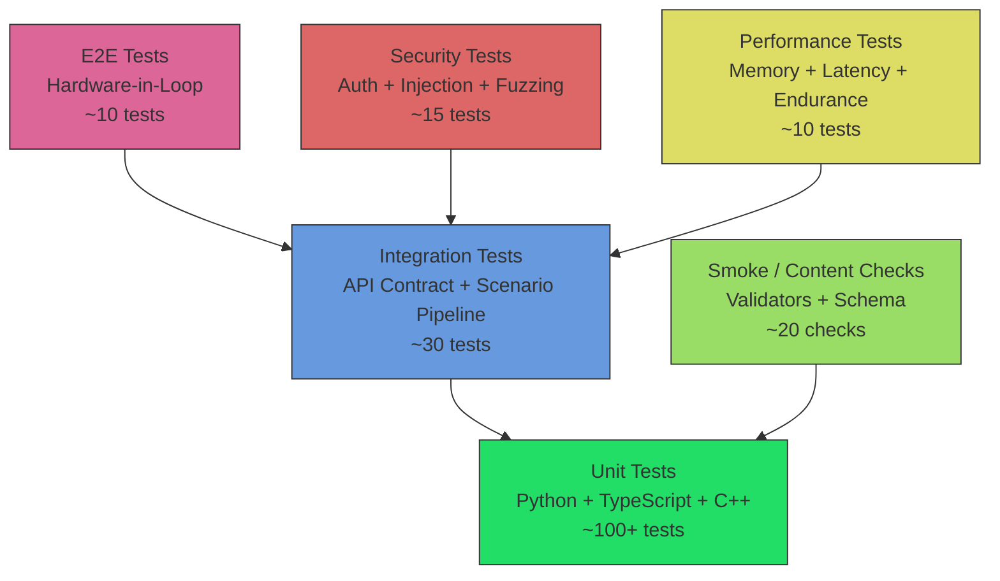
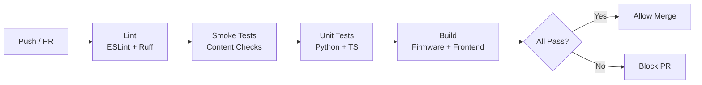

# QA Test Matrix Specification

## Status
- State: draft
- Date: 2026-03-21
- Depends on: `ZACUS_RUNTIME_3_SPEC.md`, `FIRMWARE_WEB_DATA_CONTRACT.md`, `AI_INTEGRATION_SPEC.md`

## 1) Objective

Define a unified test matrix covering all components of the Zacus platform: firmware (C++), frontend (TypeScript/React), tooling (Python), content (YAML/JSON), and AI integrations. Establish coverage targets, tooling, and CI gates.

## 2) Test Pyramid



## 3) Unit Tests

### 3.1 Python Tooling (Runtime 3)

| ID | Test | File | Priority |
|----|------|------|----------|
| PY-U-01 | Compile valid YAML to IR JSON | `test_compile_runtime3.py` | P0 |
| PY-U-02 | Compile invalid YAML (missing fields) | `test_compile_runtime3.py` | P0 |
| PY-U-03 | Simulate linear scenario (no cycles) | `test_simulate_runtime3.py` | P0 |
| PY-U-04 | Simulate scenario with branch/merge | `test_simulate_runtime3.py` | P1 |
| PY-U-05 | Detect transition cycles (max_steps) | `test_simulate_runtime3.py` | P0 |
| PY-U-06 | Validate step_id uniqueness | `test_validate_runtime3.py` | P0 |
| PY-U-07 | Validate transition target exists | `test_validate_runtime3.py` | P0 |
| PY-U-08 | normalize_token edge cases | `test_runtime3_common.py` | P1 |
| PY-U-09 | Schema version migration (v1 -> v2) | `test_runtime3_common.py` | P2 |
| PY-U-10 | Export firmware bundle structure | `test_export_runtime3.py` | P1 |
| PY-U-11 | Pivot verification pass/fail | `test_verify_pivots.py` | P1 |
| PY-U-12 | Audio manifest validation | `test_audio_validation.py` | P1 |
| PY-U-13 | Printables manifest validation | `test_printables_validation.py` | P1 |

**Runner**: `uv run python -m pytest tests/runtime3/ -v`
**Coverage target**: 80%
**Tool**: pytest + coverage.py

### 3.2 TypeScript Frontend (React + Blockly)

| ID | Test | File | Priority |
|----|------|------|----------|
| FE-U-01 | ScenarioLib: load valid YAML | `scenario.test.ts` | P0 |
| FE-U-02 | ScenarioLib: reject malformed YAML | `scenario.test.ts` | P0 |
| FE-U-03 | Runtime3Lib: compile to IR | `runtime3.test.ts` | P0 |
| FE-U-04 | Runtime3Lib: validate schema version | `runtime3.test.ts` | P1 |
| FE-U-05 | API client: request formatting | `api.test.ts` | P0 |
| FE-U-06 | API client: timeout handling | `api.test.ts` | P0 |
| FE-U-07 | API client: error response parsing | `api.test.ts` | P1 |
| FE-U-08 | Blockly: workspace to YAML round-trip | `blockly.test.ts` | P1 |
| FE-U-09 | Blockly: custom block registration | `blockly.test.ts` | P2 |
| FE-U-10 | Zod schema validation | `schemas.test.ts` | P1 |
| FE-U-11 | App component renders tabs | `App.test.tsx` | P1 |
| FE-U-12 | ErrorBoundary catches throw | `ErrorBoundary.test.tsx` | P1 |

**Runner**: `npm test` (Vitest)
**Coverage target**: 70%
**Tool**: Vitest + @testing-library/react

### 3.3 C++ Firmware

| ID | Test | File | Priority |
|----|------|------|----------|
| FW-U-01 | JSON parser: valid scenario | `test_json_parser.cpp` | P0 |
| FW-U-02 | JSON parser: malformed input | `test_json_parser.cpp` | P0 |
| FW-U-03 | Transition engine: event dispatch | `test_transitions.cpp` | P0 |
| FW-U-04 | Transition engine: priority ordering | `test_transitions.cpp` | P1 |
| FW-U-05 | Audio manager: buffer lifecycle | `test_audio.cpp` | P1 |
| FW-U-06 | Storage manager: NVS read/write | `test_storage.cpp` | P1 |
| FW-U-07 | LED manager: color conversion | `test_led.cpp` | P2 |
| FW-U-08 | Input validation: API params | `test_input_validation.cpp` | P0 |
| FW-U-09 | Rate limiter: token bucket | `test_rate_limiter.cpp` | P1 |
| FW-U-10 | PSRAM allocator: fallback chain | `test_allocator.cpp` | P1 |

**Runner**: `pio test -e native` (PlatformIO native test)
**Coverage target**: 60% (limited by hardware abstraction)
**Tool**: PlatformIO Unity test framework

## 4) Integration Tests

### 4.1 API Contract Tests

| ID | Test | Priority |
|----|------|----------|
| INT-01 | ESP32 API: GET /api/status returns valid JSON | P0 |
| INT-02 | ESP32 API: POST /api/scenario/transition changes step | P0 |
| INT-03 | ESP32 API: POST /api/audio plays file | P1 |
| INT-04 | ESP32 API: POST /api/led sets color | P1 |
| INT-05 | ESP32 API: unauthorized request returns 401 | P0 |
| INT-06 | ESP32 API: invalid JSON returns 400 | P0 |
| INT-07 | ESP32 API: rate limit triggers 429 | P1 |
| INT-08 | mascarade API: POST /api/v1/send returns hint | P1 |
| INT-09 | MCP server: tools/list returns all tools | P0 |
| INT-10 | MCP server: tools/call puzzle_set_state | P1 |

**Runner**: `uv run python -m pytest tests/integration/ -v -m integration`
**Tool**: pytest + httpx (async HTTP client)

### 4.2 Scenario Pipeline Tests

| ID | Test | Priority |
|----|------|----------|
| PIPE-01 | YAML -> compile -> simulate -> export: full pipeline | P0 |
| PIPE-02 | Modified YAML -> recompile preserves step IDs | P0 |
| PIPE-03 | Firmware bundle matches expected schema | P0 |
| PIPE-04 | Blockly export -> YAML -> compile round-trip | P1 |
| PIPE-05 | Multi-scenario compilation (batch) | P2 |

**Runner**: `uv run python -m pytest tests/pipeline/ -v`

## 5) End-to-End Tests (Hardware-in-Loop)

| ID | Test | Priority |
|----|------|----------|
| E2E-01 | Flash firmware -> boot -> API responds | P0 |
| E2E-02 | Upload scenario -> play through all steps | P0 |
| E2E-03 | Audio playback: file plays, completion event fires | P1 |
| E2E-04 | LED sequence: scenario-driven color changes | P1 |
| E2E-05 | ESP-NOW: pair two devices, relay message | P1 |
| E2E-06 | OTA update: push new firmware, device reboots | P2 |
| E2E-07 | Serial command suite: all commands respond | P0 |
| E2E-08 | WiFi reconnection after dropout | P1 |
| E2E-09 | Watchdog recovery after hang | P2 |
| E2E-10 | Full game session (90 min endurance) | P1 |

**Runner**: Manual or CI with hardware runner
**Tool**: pytest + pyserial (serial commands) + httpx (API verification)

### 5.1 Serial Test Suite

The firmware exposes a serial command interface for testing:

```
> status
OK step=STEP_U_SON_PROTO uptime=12345 heap=245000

> transition UNLOCK_COFFRE
OK step=STEP_COFFRE_OPEN

> audio play /audio/hint_01.mp3
OK playing hint_01.mp3

> led puzzle #FF0000 solid
OK led_set zone=puzzle color=#FF0000
```

Serial tests validate all commands and expected responses.

## 6) Smoke Tests (Content Checks)

| ID | Check | Gate | Tool |
|----|-------|------|------|
| SMOKE-01 | Scenario YAML schema valid | CI | yamllint + custom validator |
| SMOKE-02 | All step_ids referenced in transitions exist | CI | compile_runtime3.py |
| SMOKE-03 | All audio files referenced in YAML exist | CI | validate_audio.sh |
| SMOKE-04 | All printable assets referenced exist | CI | validate_printables.sh |
| SMOKE-05 | Runtime 3 IR compiles without errors | CI | compile_runtime3.py |
| SMOKE-06 | Runtime 3 simulation completes (no deadlocks) | CI | simulate_runtime3.py |
| SMOKE-07 | Firmware compiles for freenove_esp32s3 | CI | pio run |
| SMOKE-08 | Firmware compiles for esp8266_oled | CI | pio run |
| SMOKE-09 | Frontend builds without errors | CI | npm run build |
| SMOKE-10 | Frontend lint passes | CI | npm run lint |
| SMOKE-11 | MkDocs builds without warnings | CI | mkdocs build --strict |
| SMOKE-12 | No hardcoded credentials in source | CI | grep + custom script |

**Runner**: `bash tools/test/run_content_checks.sh`
**CI trigger**: Every push to main, every PR

## 7) Security Tests

| ID | Test | Priority | Tool |
|----|------|----------|------|
| SEC-01 | API endpoints require Bearer token | P0 | httpx |
| SEC-02 | Invalid token returns 401 | P0 | httpx |
| SEC-03 | SQL/NoSQL injection in API params | P1 | custom fuzzer |
| SEC-04 | XSS in scenario text fields | P1 | custom fuzzer |
| SEC-05 | Path traversal in audio file paths | P0 | httpx |
| SEC-06 | JSON bomb (deeply nested) rejected | P1 | httpx |
| SEC-07 | Oversized request body rejected (>1 MB) | P1 | httpx |
| SEC-08 | Rate limiting enforced (>10 req/s) | P1 | httpx |
| SEC-09 | CORS: only allowed origins accepted | P1 | httpx |
| SEC-10 | No credentials in firmware binary | P0 | strings + grep |
| SEC-11 | NVS credentials not in plaintext flash dump | P1 | esptool |
| SEC-12 | WebSocket auth on connect | P1 | websockets |
| SEC-13 | MCP server: tool call auth validated | P0 | pytest |
| SEC-14 | Prompt injection in LLM hint requests | P1 | custom prompts |
| SEC-15 | WiFi deauth resilience (reconnect) | P2 | aireplay-ng |

**Runner**: `uv run python -m pytest tests/security/ -v -m security`

## 8) Performance Tests

| ID | Test | Target | Tool |
|----|------|--------|------|
| PERF-01 | ESP32 free heap after boot | > 200 KB | serial monitor |
| PERF-02 | ESP32 free heap after 1h runtime | > 150 KB (no leak) | serial monitor |
| PERF-03 | API response time (GET /status) | < 50 ms | httpx + timing |
| PERF-04 | API response time (POST /transition) | < 100 ms | httpx + timing |
| PERF-05 | Audio playback start latency | < 200 ms | oscilloscope/logic analyzer |
| PERF-06 | LED update latency | < 50 ms | logic analyzer |
| PERF-07 | Frontend build size | < 3 MB gzip | npm run build |
| PERF-08 | Frontend initial load time | < 2 s (LAN) | Lighthouse |
| PERF-09 | Runtime 3 compile time (50 steps) | < 1 s | pytest benchmark |
| PERF-10 | 90-min endurance: no crash, no memory leak | Pass | serial + API monitor |

**Runner**: `uv run python -m pytest tests/performance/ -v -m perf --benchmark`

## 9) Test Environments

| Environment | Purpose | Hardware | Network |
|-------------|---------|----------|---------|
| **Local dev** | Unit + smoke tests | MacBook (GrosMac) | None required |
| **Native test** | C++ unit tests (no hardware) | Any x86/ARM | None |
| **Hardware bench** | Integration + E2E | ESP32-S3 Freenove + USB | WiFi AP |
| **CI runner** | Smoke + unit + lint | GitHub Actions | Cloud |
| **Staging mesh** | Multi-device E2E | 2-3 ESP32-S3 + AP | Dedicated WiFi |
| **Field test** | Full game session | Complete room setup | Production WiFi |

### 9.1 CI Pipeline (GitHub Actions)



**CI jobs**:
```yaml
jobs:
  lint:
    - npm run lint (frontend)
    - ruff check tools/ tests/ (python)
  smoke:
    - bash tools/test/run_content_checks.sh
  unit-python:
    - uv run python -m pytest tests/runtime3/ -v --cov
  unit-frontend:
    - cd frontend-scratch-v2 && npm test -- --coverage
  build-firmware:
    - cd hardware/firmware && pio run -e freenove_esp32s3
  build-frontend:
    - cd frontend-scratch-v2 && npm run build
  docs:
    - python -m mkdocs build --strict
```

## 10) Coverage Targets

| Component | Current | Target (Phase 1) | Target (Phase 2) |
|-----------|---------|-------------------|-------------------|
| Python tooling | ~20% (5 tests) | 60% (25 tests) | 80% (40 tests) |
| Frontend (TS) | 0% | 40% (12 tests) | 70% (25 tests) |
| Firmware (C++) | 0% | 30% (10 tests) | 60% (20 tests) |
| Content checks | 80% | 90% (12 checks) | 95% (15 checks) |
| Integration | 0% | 30% (5 tests) | 60% (10 tests) |
| Security | 0% | 40% (6 tests) | 70% (12 tests) |

## 11) Test Data Management

### 11.1 Fixtures

- `tests/fixtures/valid_scenario.yaml` — minimal valid scenario (3 steps)
- `tests/fixtures/complex_scenario.yaml` — full scenario with branches (15 steps)
- `tests/fixtures/invalid_*.yaml` — various malformed scenarios
- `tests/fixtures/runtime3_ir.json` — expected compiled output
- `tests/fixtures/firmware_bundle/` — expected export structure

### 11.2 Mocks

- `tests/mocks/esp32_api.py` — Mock ESP32 HTTP API (httpx responder)
- `tests/mocks/mascarade_api.py` — Mock mascarade API
- `tests/mocks/serial_device.py` — Mock serial port (pyserial loopback)

## 12) Defect Tracking

| Severity | Response Time | Resolution Time |
|----------|--------------|-----------------|
| CRITICAL (game-blocking) | 1 hour | 24 hours |
| HIGH (feature broken) | 4 hours | 72 hours |
| MEDIUM (degraded UX) | 24 hours | 1 week |
| LOW (cosmetic) | 1 week | Next release |

All defects tracked as GitHub Issues with labels: `bug`, `severity/{critical,high,medium,low}`, `component/{firmware,frontend,tooling,content,ai}`.
