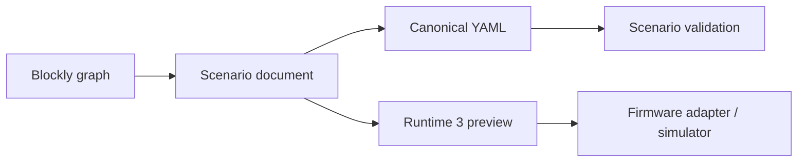

# Spécification frontend - Zacus Studio React + Blockly

## Objectif

Définir le frontend canonique de la refonte:
- édition Blockly-first,
- génération YAML canonique,
- prévisualisation IR Zacus Runtime 3,
- pilotage runtime et diagnostics via API.

## Stack retenue
- React 19
- Vite
- Blockly
- Monaco Editor
- Zod pour la validation locale

Implémentation active:
- `frontend-scratch-v2/src/App.tsx`
- `frontend-scratch-v2/src/components/BlocklyDesigner.tsx`
- `frontend-scratch-v2/src/lib/scenario.ts`
- `frontend-scratch-v2/src/lib/runtime3.ts`
- `frontend-scratch-v2/src/lib/api.ts`

## Décision UX
- Le moteur auteur canonique est Blockly, pas Cytoscape.
- Le YAML reste visible comme vérité éditoriale.
- L'IR Runtime 3 est visible en lecture seule comme contrat d'exécution.
- Le studio doit rester utilisable sans carte branchée pour l'édition et la simulation locale.

## Modèle de données auteur

`StoryGraphDocument`
- `scenarioId`
- `version`
- `initialStep`
- `steps[]`
- `steps[].transitions[]`

`StepTransition`
- `eventType`
- `eventName`
- `targetStepId`
- `priority`
- `afterMs`

## Flux principal

## Exigences fonctionnelles
- Le designer doit produire un scénario valide même si aucune transition explicite n'est dessinée.
- Le parser doit réimporter:
  - `runtime3.steps`
  - `firmware.steps`
  - `steps_narrative`
  - `firmware.steps_reference_order` (bridge deprecated; prefer `firmware.steps`)
- Les transitions invalides doivent être signalées localement.
- Le studio doit exposer:
  - vue YAML canonique,
  - vue IR Runtime 3,
  - build/lint sans erreur,
  - branchement vers `VITE_STORY_API_BASE`.

## Contrat runtime
- Le frontend ne définit pas la logique d'exécution finale.
- Le frontend compile une représentation auteur vers l'IR Runtime 3.
- Les routes runtime restent web-first et compatibles avec l'adaptateur firmware.

## Critères d'acceptation
- `npm run lint` vert.
- `npm run build` vert.
- Roundtrip Blockly -> YAML -> Runtime 3 cohérent sur `zacus_v2.yaml`.
- Les transitions affichées dans le studio correspondent aux cibles runtime.
- Le YAML affiché dans le studio reflète exactement l'état Blockly courant.

## Hors-scope
- Réactivation du frontend legacy Svelte/Cytoscape.
- Réécriture du firmware depuis le frontend.
- Authoring multi-scenarios complexe tant que le flux canonique V3 n'est pas stabilisé.
